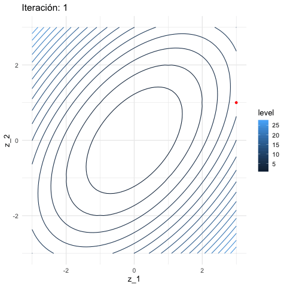

# Regresión lineal {#regresion}

```{r, include = FALSE}
library(ggplot2)
theme_set(theme_minimal(base_size = 14))
cbbPalette <- c("#000000", "#E69F00", "#56B4E9", "#009E73", "#F0E442", "#0072B2", "#D55E00", "#CC79A7")
```

## Modelos lineales

Consideramos un problema de regresión con entradas $X=(X_1,X_2,\ldots, X_p)$
y respuesta $Y$. Una de las maneras más simples que podemos intentar
para predecir $Y$ en función de las $X_j$´s es mediante una suma ponderada
de los valores de las $X_j's$, usando una función

$$f_\beta (X) = \beta_0 + \beta_1 X_1 + \beta_2 X_2 + \cdots + \beta_p X_p,$$
Nuestro trabajo será entonces, dada una muestra de entrenamiento ${\mathcal L}$,
encontrar valores apropiados de las $\beta$'s, para construir un predictor:

$$\hat{f}(X) = \hat{\beta}_0 + \hat{\beta}_1 X_1 + \hat{\beta}_2 X_2 \cdots + \hat{\beta} X_p$$
y usaremos esta función $\hat{f}$ para hacer predicciones $\hat{Y} =\hat{f}(X)$.


#### Ejemplos {-}

Queremos predecir las ventas futuras anuales $Y$ de una tienda que se va a construir
en un lugar dado. Las variables que describen el lugar son
$X_1 = trafico\_peatones$, $X_2=trafico\_coches$. En una aproximación simple,
podemos suponer que la tienda va a capturar una fracción de esos tráficos que
se van a convertir en ventas. Quisieramos predecir con una función de la forma
$$f_\beta (peatones, coches) = \beta_0 + \beta_1\, peatones + \beta_2\, coches.$$
Por ejemplo, después de un análisis estimamos que 

- $\hat{\beta}_0 = 1000000$ (ventas base, si observamos tráficos igual a 0: es lo que va a atraer la tienda)
- $\hat{\beta}_1 = (200)*0.02 = 4$ (capturamos 2\% del tráfico peatonal, y cada capturado gasta 200 pesos)
- $\hat{\beta}_2 = (300)*0.01 =3$ (capturamos 2\% del tráfico peatonal, y cada capturado gasta 400 pesos)
Entonces haríamos predicciones con
$$\hat{f}(peatones, coches) = 1000000 +  4\,peatones + 3\, coches.$$
El modelo lineal es más flexible de lo que parece en una primera aproximación, porque
tenemos libertad para construir las variables de entrada a partir de nuestros datos.
Por ejemplo, si tenemos una tercera variable 
$estacionamiento$ que vale 1 si hay un estacionamiento cerca o 0 si no lo hay, podríamos
definir las variables
- $X_1= peatones$
- $X_2 = coches$
- $X_3 = estacionamiento$
- $X_4 = coches*estacionamiento$

Donde la idea de agregar $X_4$ es que si hay estacionamiento entonces vamos
a capturar una fracción adicional del trafico de coches, y la idea de $X_3$ es que 
la tienda atraerá más nuevas visitas si hay un estacionamiento cerca. Buscamos 
ahora modelos de la forma
$$f_\beta(X_1,X_2,X_3,X_4) = \beta_0 + \beta_1X_1 + \beta_2 X_2 + \beta_3 X_3 +\beta_4 X_4$$
y podríamos obtener después de nuestra análisis las estimaciones
- $\hat{\beta}_0 = 800000$ (ventas base)
- $\hat{\beta}_1 = 4$
- $\hat{\beta}_2 = (300)*0.005 = 1.5$
- $\hat{\beta}_3 = 400000$ (ingreso adicional si hay estacionamiento por nuevo tráfico)
- $\hat{\beta}_4 = (300)*0.02 = 6$ (ingreso adicional por tráfico de coches si hay estacionamiento)
 
 y entonces haríamos predicciones con el modelo
$$\hat{f} (X_1,X_2,X_3,X_4) = 
800000 + 4\, X_1 + 1.5 \,X_2 + 400000\, X_3 +6\, X_4$$

## Aprendizaje de coeficientes (ajuste)
En el ejemplo anterior, los coeficientes fueron calculados (o estimados) usando
experiencia, reglas, argumentos teóricos, o quizá otras fuentes de datos (como estudios
o encuestas, conteos, etc.) 

Ahora quisiéramos construir un algoritmo para
aprender estos coeficientes del modelo
$$f_\beta (X_1) = \beta_0 + \beta_1 X_1 + \cdots \beta_p X_p$$
a partir de una muestra de entrenamiento de datos históricos de tiendas que hemos
abierto antes:
$${\mathcal L}=\{ (x^{(1)},y^{(1)}),(x^{(2)},y^{(2)}), \ldots, (x^{(N)}, y^{(N)}) \}$$
El criterio de ajuste (algoritmo de aprendizaje) más usual para regresión 
lineal es el de **mínimos cuadrados**. 

Construimos las predicciones (ajustados) para la muestra de entrenamiento:
$$\hat{y}^{(i)} =  f_\beta (x^{(i)}) = \beta_0 + \beta_1 x_1^{(i)}+ \cdots + \beta_p x_p^{(i)}$$

Y consideramos las diferencias de los ajustados con los valores observados:

$$e^{(i)} = y^{(i)} - f_\beta (x^{(i)})$$

La idea entonces es minimizar la suma de los residuales al cuadrado, para
intentar que la función ajustada pase lo más cercana a los puntos de entrenamiento 
que sea posible. La función de pérdida que utilizamos más frecuentemente
es la pérdida cuadrática, dada por:

$$L(\beta) = ECM(\beta) = \frac{1}{N}\sum_{i=1}^N (y^{(i)} - f_\beta(x^{(i)}))^2$$
(ECM es el *error cuadrático medio*).

```{block2, type = 'comentario'}
**Mínimos cuadrados para regresión lineal**
Buscamos encontrar:
$$\hat{\beta} = \mathrm{arg\,min}_{\beta} L(\beta) = \mathrm{arg\,min}_{\beta}\frac{1}{N}\sum_{i=1}^N (y^{(i)} - f_\beta(x^{(i)}))^2$$
    donde
 $$f_\beta (x^{(i)}) = \beta_0 + \beta_1 x_1^{(i)}+ \cdots + \beta_p x_p^{(i)}$$
```

**Observación**:
Como discutimos al final de las sección anterior, minimizar directamente el error
 de entrenamiento para encontrar los coeficientes puede resultar en en un modelo
 sobreajustado/con varianza alta/ruidoso. Hay
 tres grandes estrategias para mitigar este problema: restringir o estructurar la familia
 de funciones, penalizar la función objetivo o perturbar la muestra de entrenamiento.
 El método mas común es cambiar la función objetivo, que discutiremos más adelante
 en la sección de regularización.
 

### Ejemplo {-}

Consideramos el problema de predecir el precio de venta de una casa en términos
de sus características. Para esto usamos datos de [este concurso de Kaggle](https://www.kaggle.com/c/house-prices-advanced-regression-techniques).

```{r, message = FALSE, warning = FALSE}
library(tidyverse)
casas <- read_csv("../datos/houseprices/house-prices.csv")
```

¿Cuáles deberían ser las variables más importantes? Debemos considerar
al menos, el tamaño de las casas, la calidad de sus terminados, su ubicación,
y tipo de casa (dos pisos, un piso, etc.). 
Vamos a comenzar consierando tamaño, calidad y tipo de casa. Un modelo que no tiene mucho sentido
empezar ajustando es

$$Precio = \beta_0 + \beta_1 Calidad + \beta_2 Tamaño + \beta_3 Pisos,$$

porque esto implicaría que el precio por metro cuadrado de las casas es constante,
y la calidad de las casas solo aporta una cantidad fija a su precio total. Una estrategia
que podemos considerar es el modelo:

$$Precio =  \left( \beta_0 + \beta_1 \,Calidad + \beta_2 \,Pisos\right) \, Tamaño$$
Es decir, el precio por metro cuadrado varía con la calidad y el número de pisos. Podemos modelar
entonces, en lugar del Precio, 

$$Precio_{m^2} = \beta_0 + \beta_1 \, Calidad + \beta_2 \, Pisos,$$

y *este es un modelo lineal*. Para hacer predicciones del *Precio*, después multiplicamos
la predicción del precio por metros cuadrados por *Tamaño*. 

En primer lugar, dividimos los datos en al menos dos partes: una parte para entrenar
el modelo y otra para validarlo (estimar el error de predicción). 

```{r}
set.seed(13)
casas_ent <- sample_frac(casas, 0.7)
casas_val <- anti_join(casas, casas_ent, by = "Id")
sprintf("Total: %1.f, Entrena: %1.f, Validación: %1.f",  
        nrow(casas), nrow(casas_ent), nrow(casas_val))
```

Y requerimos calcular la variable adicional de *Pisos*. Los datos sólo reportan
hasta 2 pisos de área habitable, así que esta variable valdrá 1 si hay segundo piso
y 0 si no y calculamos algunas otras variables derivadas. En este caso podemos escribir una
función que aplicamos tanto a entrenamiento como validación:

```{r}
agregar_vars <- function(dat){
    dat_nueva <- dat %>% mutate(tiene_piso_2 = as.numeric(`2ndFlrSF` > 0),
                                precio_miles = SalePrice / 1000, 
                                habitable_m2 = (GrLivArea * 0.092903),
                                precio_m2_miles = precio_miles / habitable_m2,
                                calidad = OverallQual - 5)
    dat_nueva
}
casas_ent <- casas_ent %>% agregar_vars
casas_val <- casas_val %>% agregar_vars
write_rds(casas_ent, "../temp/casas_ent.rds")
write_rds(casas_ent, "../temp/casas_val.rds")
```


Veamos unos resúmenes de nuestra muestra de entrenamiento:
```{r}
casas_ent %>% pull(precio_miles) %>% quantile
casas_ent %>% pull(precio_m2_miles) %>% quantile
casas_ent %>% pull(habitable_m2) %>% quantile %>% round(2)
casas_ent %>% pull(calidad) %>% quantile
```


```{r}
graf_ent <- ggplot(casas_ent, aes(x = calidad, y = precio_m2_miles)) + 
    geom_jitter(size=1, alpha = 0.5, width = 0.3, height = 0) + 
    facet_wrap(~tiene_piso_2) 
graf_ent
```

Podemos poner algunos valores tentativos a los coeficientes y evaluar nuestro modelo:

```{r}
beta <- c(1, 0.2, 0.5)
names(beta) <- c("beta_0", "beta_1", "beta_2")
beta
```


```{r}
preds_fun <- function(beta){
    function(x_ent){
        cbind(1, x_ent) %*% beta
    }
}
x_ent <- casas_ent %>% select(calidad, tiene_piso_2) %>% as.matrix
y_ent <- casas_ent$precio_m2_miles
predecir <- preds_fun(beta)
y_hat <- predecir(x_ent)
```

El error cuadrático medio con estos parámetros es
```{r}
ecm <- mean((y_ent - y_hat)^2)
ecm
```

Y su raíz (que está en unidades de miles de dólares):
```{r}
sqrt(ecm)
```

Como estamos considerando pocas variables, podemos graficar para ver cómo
se comparan valores ajustadas con observados:

```{r}
graf_ent + geom_line(data = casas_ent %>% mutate(preds = y_hat), 
    aes(x = calidad, y = preds, col = "red"))
```


**Ejercicio**: ¿Cómo mejoramos el ajuste? Tenemos que minimizar el
error cuadrático medio. Usa estas gráficas para modificar los parámetros y minimizar 
el error cuadrático medio (utiliza el app en la carpeta ``apps/``).

---

Finalmente calculamos el error de validación para el modelo seleccionado, que
nos da una **medida honesta** del error que esperamos al usar el modelo
para nuevos casos:

```{r}
x_val <- casas_val %>% select(calidad, tiene_piso_2) %>% as.matrix
y_val <- casas_val$precio_m2_miles
beta <- c(1.3, 0.16, -0.5) # interpreta estos coeficientes
predecir <- preds_fun(beta)
y_pred <- predecir(x_val)
y_hat <- predecir(x_ent)

sprintf ("Error entrenamiento: %3.2f, Error validación: %3.2f (miles de dólares)", 
         sqrt(mean((y_ent  - y_hat)^2)),
         sqrt(mean((y_val - y_pred)^2)))
```

También podemos escribir como coeficientes de variación:

```{r}
sprintf ("Error entrenamiento: %3.2f, Error validación: %3.2f (%%)", 
         sqrt(mean((y_ent  - y_hat)^2)) / mean(y_ent),
         sqrt(mean((y_val - y_pred)^2)) / mean(y_val))
```

En este caso ambos errores son muy similares, aunque típicamente el error de validación
tiende a ser más alto que el de entrenamiento. Podemos también comparar observados y 
ajustados para ver cómo se comportan los
errores:

```{r}
pred_obs <- tibble(y_hat = y_hat, y_ent = y_ent)
ggplot(pred_obs, aes(x = y_hat, y = y_ent, alpha = 0.5)) +
    geom_point() +
    geom_abline(colour = "red")
```

Y notamos que algunas predicciones son considerablemente malas ¿Cómo crees que podamos
arreglar este problema?.

---


## Aprendizaje de parámeteros para regresión lineal

Ahora veremos cómo resolver el problema de minimización para ajustar el modelo
de regresión lineal con error cuadrático. Hay varias maneras de hacer esto:

- En el enfoque tradicional, se usan soluciones analíticas del problema de minimización
y técnicas de álgebra lineal (por ejemplo, *lm* en R). Este método es efectivo para problemas chicos y medianos. Estas técnicas se escalan en parte a problemas grandes, pero no es muy simple hacerlo.
- Es posible utilizar algoritmos de optimización estándar. Hay una variedad grande de ellos,
algunos muy sofisticados y poderosos, pero en muchos problemas grandes no necesariamente
escalan apropiadamente.
- En términos de escalamiento y simplicidad, el método de descenso en gradiente y sus
variantes es muy efectivo
para escalar a datos grandes y modelos más complejos (por ejemplo redes neuronales). 

Notamos que el problema de minimización para regresión no es particularmente difícil:

- Se puede demostrar que la función objectivo es convexa.
- Sin embargo, en algunos casos puede ser que la función objetivo tenga regiones muy planas,
lo cual hace difícil la optimización para la mayoría de los métodos. En la siguiente sección
veremos por qué puede pasar esto y como mejorar este problema.


## Descenso en gradiente para regresión lineal

Aunque el problema de mínimos cuadrados se puede resolver analíticamente, o
usando un optimizador avanzado de R, proponemos
un método numérico básico que es efectivo y puede escalarse a problemas grandes
de manera relativamente simple: **descenso en gradiente**, o descenso máximo.

### Intro a descenso en gradiente {-}

Supongamos que una función $h(x)$ es convexa y tiene un mínimo. La idea
de descenso en gradiente es comenzar con un candidato inicial $z_0$ y calcular
la derivada en $z^{(0)}$. Si $h'(z^{(0)})>0$, la función es creciente en $z^{(0)}$ y nos
movemos ligeramente 
a la izquierda para obtener un nuevo candidato $z^{(1)}$. si $h'(z^{(0)})<0$, la
función es decreciente en $z^{(0)}$ y nos
movemos ligeramente a la derecha  para obtener un nuevo candidato $z^{(1)}$. Iteramos este
proceso hasta que la derivada es cercana a cero (estamos cerca del óptimo).

Si $\eta>0$ es una cantidad chica, podemos escribir

$$z^{(1)} = z^{(0)} - \eta \,h'(z^{(0)}).$$

Nótese que cuando la derivada tiene magnitud alta, el movimiento de $z^{(0)}$ a $z^{(1)}$
es más grande, y siempre nos movemos una fracción de la derivada. En general hacemos
$$z^{(j+1)} = z^{(j)} - \eta\,h'(z^{(j)})$$
para obtener una sucesión $z^{(0)},z^{(1)},\ldots$. Esperamos a que $z^{(j)}$ converja
para terminar la iteración.

#### Ejemplo {-}

Si tenemos
```{r}
h <- function(x) x^2 + (x - 2)^2 - log(x^2 + 1)
```

Calculamos (a mano):
```{r}
h_deriv <- function(x) 2 * x + 2 * (x - 2) - 2*x/(x^2 + 1)
```

Ahora iteramos con $\eta = 0.4$ y valor inicial $z_0=5$
```{r}
z_0 <- 5
eta <- 0.4
descenso <- function(n, z_0, eta, h_deriv){
  z <- matrix(0,n, length(z_0))
  z[1, ] <- z_0
  for(i in 1:(n-1)){
    z[i+1, ] <- z[i, ] - eta * h_deriv(z[i, ])
  }
  z
}
z <- descenso(20, z_0, eta, h_deriv)
z
```

Y vemos que estamos cerca de la convergencia. Podemos graficar:

```{r}
dat_iteraciones <- tibble(iteracion = 1:nrow(z), 
                              x = z[, 1], y = h(z[, 1]))
```

```{r, fig.width = 4, fig.asp = 0.7, out.width="400px", message=FALSE, warning = FALSE}
library(gganimate)
curva <- ggplot(tibble(x = seq(-4, 5, 0.1)), aes(x = x)) + stat_function(fun = h) +
     xlim(c(-4, 5))
descenso_g <- curva +
    geom_point(data = dat_iteraciones, aes(x = x, y = y), col = "red", size = 3) +
    transition_time(iteracion) + 
    theme_minimal(base_size = 20)
animate(descenso_g)
```


#### Selección de tamaño de paso $\eta$ {-}

Buscamos un $\eta$ apropiado para cada problema:

- Si hacemos $\eta$ muy chico, el algoritmo puede tardar mucho en
converger.
- Si hacemos $\eta$ demasiado grande, el algoritmo puede divergir.

```{r}
z_eta_chico <- descenso(20, 5, 0.01, h_deriv)
z_eta_grande <- descenso(20, 1.8, 0.6, h_deriv)
dat_chico <- tibble(iteracion = 1:nrow(z), x = z_eta_chico[, 1], y = h(z_eta_chico[, 1]), tipo = "η = 0.01")
dat_grande <- tibble(iteracion = 1:nrow(z), x = z_eta_grande[, 1], y = h(z_eta_grande[, 1]), tipo = "η = 0.6")
dat_iteraciones$tipo <- "η = 0.03"
dat <- bind_rows(dat_chico, dat_grande, dat_iteraciones)
```

```{r, message = FALSE, warning = FALSE}
library(gganimate)
curva <- ggplot(tibble(x = seq(-4, 5, 0.1)), aes(x = x)) + stat_function(fun = h, colour = "gray") +
     xlim(c(-4, 5))
descenso_3 <- curva +
    geom_point(data = dat, aes(x = x, y = y), col = "red", size = 3) +
    facet_wrap(~tipo, nrow = 1) + ylim(c(0, 50)) +
    transition_time(iteracion) +
    labs(title = "Iteración {frame_time}") + 
    theme_minimal(base_size = 20)
animate(descenso_3, width = 1000, height = 300)
```


```{block2, type='comentario'}
Es necesario ajustar el tamaño de paso para cada problema particular. Si la 
convergencia es muy lenta, podemos incrementarlo. Si las iteraciones divergen,
podemos disminuirlo
```

#### Funciones de varias variables {-}
Si ahora $h(z)$ es una función de $p$ variables, podemos intentar
la misma idea usando el gradiente, que está definido por:

$$\nabla h(z) = \left( \frac{\partial h}{\partial z_1}, \frac{\partial h}{\partial z_2}, \ldots,    \frac{\partial h}{\partial z_p} \right)^t,$$
es decir, es el vector columna con las derivadas parciales de $h$.

Por cálculo sabemos que el gradiente
apunta en la dirección de máximo crecimiento local, asi que el paso de iteración,
dado un valor inicial $z_0$ y un tamaño de paso
$\eta >0$ es

$$z^{(i+1)} = z^{(i)} - \eta \nabla h(z^{(i)})$$

Las mismas consideraciones acerca del tamaño de paso $\eta$ aplican en
el problema multivariado.

```{r, fig.width=5, fig.asp=0.7}
h <- function(z) {
  z[1]^2 + z[2]^2 - z[1] * z[2]
}
h_gr <- function(z_1,z_2) apply(cbind(z_1, z_2), 1, h)
grid_graf <- expand.grid(z_1 = seq(-3, 3, 0.1), z_2 = seq(-3, 3, 0.1))
grid_graf <- grid_graf %>%  mutate( val = apply(cbind(z_1,z_2), 1, h))
gr_contour <- ggplot(grid_graf, aes(x = z_1, y = z_2, z = val)) + 
  geom_contour(binwidth = 1.5, aes(colour = ..level..))
gr_contour
```

El gradiente está dado por (calculado a mano):

```{r}
h_grad <- function(z){
  c(2*z[1] - z[2], 2*z[2] - z[1])
}
```

Podemos graficar la dirección de máximo descenso para diversos puntos. Estas
direcciones son ortogonales a la curva de nivel que pasa por cada uno de los
puntos:

```{r, fig.width=5, fig.asp=0.7}
grad_1 <- h_grad(c(0,-2))
grad_2 <- h_grad(c(1,1))
eta <- 0.2
gr_contour +
  geom_segment(aes(x = 0.0, xend = 0.0 - eta * grad_1[1], y = -2, yend = -2 - eta * grad_1[2]),
    arrow = arrow(length = unit(0.2, "cm"))) + 
  geom_segment(aes(x = 1, xend = 1 - eta * grad_2[1], y = 1, yend = 1 - eta*grad_2[2]),
    arrow = arrow(length = unit(0.2, "cm"))) + coord_fixed(ratio = 1)
```

Y aplicamos descenso en gradiente:


```{r, fig.width=5, fig.height= 3.5}
inicial <- c(3, 1)
iteraciones <- descenso(150, inicial , 0.1, h_grad)
df_iteraciones <- data.frame(iteraciones) %>%
    mutate(iteracion = 1:nrow(iteraciones))

graf_descenso_2 <- ggplot(data = df_iteraciones %>% filter(iteracion < 20)) + 
  geom_contour(data = grid_graf, 
               binwidth = 1.5, aes(x = z_1, y = z_2, z = val, colour = ..level..)) + 
  geom_point(aes(x=X1, y=X2), colour = 'red', size = 3)

if(FALSE){
    library(gganimate)
    graf_descenso_2 + 
        labs(title = 'Iteración: {frame_time}') +
        transition_time(iteracion)
    anim_save(filename = "figuras/descenso_2.gif")
}
```

{width=400px}


En este caso, para checar convergencia podemos monitorear el valor de la
función objetivo:

```{r, fig.width=5, fig.height= 3.5}
df_iteraciones <- df_iteraciones %>% 
    mutate(h_valor = map2_dbl(X1, X2, ~ h(z  = c(.x,.y)))) # h no está vectorizada
ggplot(df_iteraciones, aes(x = iteracion, y = h_valor)) + geom_point(size=1) +
    geom_line()
```
Y nuestra aproximación al mínimo es:

```{r}
df_iteraciones %>% tail(1)
```

### Cálculo del gradiente

Vamos a escribir ahora el algoritmo de descenso en gradiente para regresión lineal.
Igual que en los ejemplos anteriores, tenemos que precalcular el gradiente. Una
vez que esto esté terminado, escribir la iteración es fácil.

Recordamos que queremos minimizar (dividiendo entre dos para simplificar más adelante)
$$L(\beta) = \frac{1}{2}\sum_{i=1}^N (y^{(i)} - f_\beta(x^{(i)}))^2$$

La derivada de la suma es la suma de las derivadas, así nos concentramos
en derivar uno de los términos

$$  u^{(i)}=\frac{1}{2}(y^{(i)} - f_\beta(x^{(i)}))^2 $$
Usamos la regla de la cadena para obtener
$$ \frac{1}{2}\frac{\partial}{\partial \beta_j} (y^{(i)} - f_\beta(x^{(i)}))^2 =
-(y^{(i)} - f_\beta(x^{(i)})) \frac{\partial f_\beta(x^{(i)})}{\partial \beta_j}$$

Ahora recordamos que
$$f_{\beta} (x) = \beta_0 + \beta_1 x_1 + \beta_2 x_2 + \cdots + \beta_p x_p$$

Y vemos que tenemos dos casos. Si $j=0$,

$$\frac{\partial f_\beta(x^{(i)})}{\partial \beta_0} = 1$$
y  si $j=1,2,\ldots, p$ entonces

$$\frac{\partial f_\beta(x^{(i)})}{\partial \beta_j} = x_j^{(i)}$$

Entonces, si ponemos $u^{(i)}=\frac{1}{2}(y^{(i)} - f_\beta(x^{(i)}))^2$:


$$\frac{\partial u^{(i)}}{\partial \beta_0} = -(y^{(i)} - f_\beta(x^{(i)}))$$
y 

$$\frac{\partial u^{(i)}}{\partial \beta_j} = - x_j^{(i)}(y^{(i)} - f_\beta(x^{(i)}))$$


Y sumando todos los términos (uno para cada caso de entrenamiento):


```{block2, type='comentario'}
**Gradiente para regresión lineal**

Sea $e^{(i)} =  y_{(i)} - f_{\beta} (x^{(i)})$. Entonces

\begin{equation}
  \frac{\partial L(\beta)}{\partial \beta_0} = - \frac{1}{N}\sum_{i=1}^N e^{(i)} 
  (\#eq:grad1)
\end{equation}


\begin{equation}
  \frac{\partial L(\beta)}{\partial \beta_j} = - \frac{1}{N}\sum_{i=1}^N x_j^{(i)}e^{(i)} 
  (\#eq:grad2)
\end{equation}
para $j=1,2,\ldots, p$. 

```

Nótese que cada punto de entrenamiento contribuye
al cálculo del gradiente - la contribución es la dirección de descenso de error
para ese punto particular de entrenamiento. Nos movemos entonces en una dirección
promedio, para intentar hacer el error total lo más chico posible.


### Implementación

En este punto, podemos intentar una implemetación simple para
hacer descenso en gradiente para nuestro problema de regresión 
(es un buen ejercicio). En lugar de eso, mostraremos cómo usar librerías ahora
estándar para hacer esto. En particular usamos keras (con tensorflow), 
que tienen la ventaja:

- En tensorflow y keras no es necesario calcular las derivadas a mano. Utiliza 
[diferenciación automática](https://en.wikipedia.org/wiki/Automatic_differentiation), que no
es diferenciación numérica ni simbólica: se basa en la regla de la cadena y la codificación
explícita de las derivadas de funciones elementales.


```{r}
library(keras)

# definición de estructura del modelo (regresión lineal)
n_entrena <- nrow(x_ent)
crear_modelo <- function(lr = 0.05){
    modelo_casas <- 
        keras_model_sequential() %>%
        layer_dense(units = 1,        #una sola respuesta,
            activation = "linear",    # combinar variables linealmente
            kernel_initializer = initializer_constant(0), #inicializamos coeficientes en 0
            bias_initializer = initializer_constant(0))   #inicializamos ordenada en 0
    # compilar seleccionanfo cantidad a minimizar, optimizador y métricas
    modelo_casas %>% compile(
        loss = "mean_squared_error",  # pérdida cuadrática
        optimizer = optimizer_sgd(lr = lr), # descenso en gradiente
        metrics = list("mean_squared_error"))
    modelo_casas
}
modelo_casas <- crear_modelo()
# Ahora iteramos
# Primero probamos con un número bajo de iteraciones
historia <- modelo_casas %>% fit(
  as.matrix(x_ent), # x entradas
  y_ent,            # y salida o target
  batch_size = nrow(x_ent), # para descenso en gradiente
  epochs = 20, # número de iteraciones
  verbose = 0
)

```


```{r, fig.width =5, fig.height = 3.5}
plot(historia, metrics = "mean_squared_error", smooth = FALSE)
```

```{r}
# Agregamos iteraciones: esta historia comienza en los últimos valores de
# la corrida anterior
historia <- modelo_casas %>% fit(
  as.matrix(x_ent), # x entradas
  y_ent,            # y salida o target
  batch_size = nrow(x_ent), # para descenso en gradiente
  epochs = 1000, # número de iteraciones
  verbose = 0
)

```


```{r, fig.width =5, fig.height = 3.5}
plot(historia, metrics = "mean_squared_error", smooth = FALSE) 
```

El modelo parece todavía ir mejorando: puede dificil juzgar de esta gráfica.
Veamos de todas formas los coeficientes estimados hasta ahora:

```{r}
get_weights(modelo_casas)
```

 La implementación oficial de R es *lm*, que en general tiene buen desempeño para datos que caben en memoria:

```{r}
lm(precio_m2_miles ~ calidad + tiene_piso_2, data = casas_ent) %>% coef
```

Si lo corremos 500 iteraciones adicionales:

```{r}
historia <- modelo_casas %>% fit(
  as.matrix(x_ent), # x entradas
  y_ent,            # y salida o target
  batch_size = nrow(x_ent), # para descenso en gradiente
  epochs = 500, # número de iteraciones
  verbose = 0
)
get_weights(modelo_casas)
```


## Normalización de entradas

La convergencia de descenso en gradiente (y también el desempeño numérico
para otros algoritmos) puede dificultarse cuando las variables tienen escalas
muy diferentes. Esto produce curvaturas altas en la función que queremos
minimizar.

En este ejemplo simple, una variable tiene desviación estándar
10 y otra 1:

```{r}
x1 <- rnorm(100, 0, 5) 
x2 <- rnorm(100, 0, 1) +  0.1*x1
y <- 0*x1 + 0*x2 + rnorm(100, 0, 0.1) 
dat <- data_frame(x1, x2,  y)
rss <- function(beta)  mean((as.matrix(dat[, 1:2]) %*% beta - y)^2) 
grid_beta <- expand.grid(beta1 = seq(-1, 1, length.out = 50), 
                         beta2 = seq(-1, 1, length.out = 50))
rss_1 <- apply(grid_beta, 1, rss) 
dat_x <- data.frame(grid_beta, rss_1)
ggplot(dat_x, aes(x = beta1, y = beta2, z = rss_1)) + 
    geom_contour(binwidth = 0.5) +
    coord_equal() 
```

En algunas direcciones el gradiente es muy grande, y en otras chico. 
Esto implica que la convergencia puede ser muy lenta en algunas direcciones,
puede diverger en otras, 
y que hay que ajustar el paso $\eta > 0$ con cuidado, 
dependiendo de dónde comiencen las iteraciones.

Por ejemplo, con un tamaño de paso relativamente chico, damos unos saltos
grandes al principio y luego avanzamos muy lentamente:

```{r}
grad_calc <- function(x_ent, y_ent){
  # calculamos directamente el gradiente
  salida_grad <- function(beta){
    n <- length(y_ent)
    f_beta <- as.matrix(cbind(1, x_ent)) %*% beta
    e <- y_ent - f_beta
    grad_out <- - as.numeric(t(cbind(1, x_ent)) %*% e) / n
    names(grad_out) <- c('Intercept', colnames(x_ent))
    grad_out
  }
  salida_grad
}
grad_sin_norm <- grad_calc(dat[, 1:2, drop = FALSE], dat$y)
iteraciones <- descenso(10, c(0, -0.25, -0.75), 0.02, grad_sin_norm)
ggplot(dat_x) + 
    geom_contour(aes(x = beta1, y = beta2, z = rss_1), binwidth = 0.5) +
    coord_equal() +
  geom_path(data = data.frame(iteraciones[, 2:3]), aes(x=X1, y=X2), colour = 'red') +
  geom_point(data = data.frame(iteraciones[, 2:3]), aes(x=X1, y=X2), colour = 'red')
```

Si incrementamos el tamaño de paso observamos también convergencia lenta. En este
caso particular, subir más el tamaño de paso puede producir divergencia:

```{r}
iteraciones <- descenso(10, c(0, -0.25, -0.75), 0.07, grad_sin_norm)
ggplot(dat_x) + 
    geom_contour(aes(x = beta1, y = beta2, z = rss_1), binwidth = 0.5) +
    coord_equal() +
  geom_path(data = data.frame(iteraciones[, 2:3]), aes(x=X1, y=X2), colour = 'red') +
  geom_point(data = data.frame(iteraciones[, 2:3]), aes(x=X1, y=X2), colour = 'red')
```

Una normalización usual es con la media y desviación estándar, donde hacemos,
para cada variable de entrada $j=1,2,\ldots, p$
$$ x_j^{(i)} = \frac{ x_j^{(i)} - \bar{x}_j}{s_j}$$
donde
$$\bar{x}_j = \frac{1}{N} \sum_{i=1}^N x_j^{(i)}$$
$$s_j = \sqrt{\frac{1}{N-1}\sum_{i=1}^N (x_j^{(i)}- \bar{x}_j )^2}$$
es decir, centramos y normalizamos por columna. Otra opción común es restar
el mínimo y dividir entre la diferencia del máximo y el mínimo, de modo
que las variables resultantes toman valores en $[0,1]$.


Entonces escalamos antes de ajustar:

```{r}
x1_s = (x1 - mean(x1))/sd(x1)
x2_s = (x2 - mean(x2))/sd(x2)
dat <- data_frame(x1_s, x2_s,  y)
rss <- function(beta)  mean((as.matrix(dat[, 1:2]) %*% beta - y)^2) 
grid_beta <- expand.grid(beta1 = seq(-1, 1, length.out = 50), 
                         beta2 = seq(-1, 1, length.out = 50))
rss_1 <- apply(grid_beta, 1, rss) 
dat_x <- data.frame(grid_beta, rss_1)
ggplot(dat_x, aes(x = beta1, y = beta2, z = rss_1)) + 
    geom_contour(binwidth = 0.5) +
    coord_equal() 
```

Nótese que los coeficientes ajustados serán diferentes a los del caso no
normalizado. 

Si normalizamos, obtenemos convergencia más rápida

```{r}
grad_sin_norm <- grad_calc(dat[, 1:2, drop = FALSE], dat$y)
iteraciones <- descenso(10, c(0, -0.25, -0.75), 0.5, grad_sin_norm)
ggplot(dat_x) + 
    geom_contour(aes(x = beta1, y = beta2, z = rss_1), binwidth = 0.5) +
    coord_equal() +
  geom_path(data = data.frame(iteraciones[, 2:3]), aes(x=X1, y=X2), colour = 'red') +
  geom_point(data = data.frame(iteraciones[, 2:3]), aes(x=X1, y=X2), colour = 'red')
```


```{block, type = 'comment'}
Cuando normalizamos antes de ajustar el modelo, las predicciones deben
hacerse con entradas normalizadas. La normalización se hace con los mismos
valores que se usaron en el entrenamiento (y **no** recalculando medias
y desviaciones estándar con el conjunto de prueba).
En cuanto a la forma funcional del predictor $f$, el problema
con entradas normalizadas es equivalente al de las entradas no normalizadas. Asegúrate
de esto escribiendo cómo correponden los coeficientes de cada modelo normalizado
con los coeficientes del modelo no normalizado.
```

Supongamos que el modelo en las variables originales  es
$${f}_\beta (X) = \beta_0 + \beta_1 X_1 + \beta_2 X_2 + \cdots + \beta_p X_p,$$
Consideramos el modelo con variables estandarizadas
$${g}_\beta (X) = \beta_0^s + \beta_1^s Z_1 + \beta_2^s Z_2 + \cdots + \beta_p^s Z_p,$$

Sustituyendo $Z_j = (X_j - \mu_j)/s_j,$ 

$${g}_{\beta^s} (X) = (\beta_0^s - \sum_{j=1}^p \mu_j/s_j) + \frac{\beta_1^s}{s_j} X_1 + \frac{\beta_2^s}{s_2} X_2 + \cdots + \frac{\beta_p^s}{s_p} X_p,$$
Y vemos que tiene la misma forma funcional de $f_\beta(X)$. Si la solución de mínimos cuadrados es única,
entonces una vez que ajustemos tenemos que tener $\hat{f}_\beta(X) = \hat{g}_{\beta^s} (X)$,
lo que implica que
$$\hat{\beta}_0 = \hat{\beta}_0^s -  \sum_{j=1}^p \mu_j/s_j$$ y
$$\hat{\beta}_j = \hat{\beta}_j^s/s_j.$$

Nótese que para pasar del problema estandarizado al no estandarizado simplemente
se requiere escalar los coeficientes por la $s_j$ correspondiente.

#### Ejemplo {-}

Repetimos nuestro modelo 

```{r}
library(keras)
# definición de estructura del modelo (regresión lineal)
n_entrena <- nrow(x_ent)
x_ent_s <- scale(x_ent)

ajustar_casas <- function(modelo, x, y, n_epochs = 100){
  ajuste <- modelo %>% fit(
    as.matrix(x), y,
    batch_size = nrow(x_ent), # para descenso en gradient
    epochs = n_epochs, # número de iteraciones
    verbose = 0) %>% as_tibble()
  ajuste
}

modelo_casas_ns <- crear_modelo(0.07)
modelo_casas_s <- crear_modelo(0.2)
historia_s <- ajustar_casas(modelo_casas_s, x_ent_s, y_ent) %>% 
  mutate(tipo = "Estandarizar")
historia_ns <- ajustar_casas(modelo_casas_ns, x_ent, y_ent) %>% 
  mutate(tipo = "Sin estandarizar")

historia <- bind_rows(historia_ns, historia_s) %>%  filter(metric == "mean_squared_error")

ggplot(historia, aes(x = epoch, y = value, colour = tipo)) +
     geom_line() + geom_point() +scale_x_log10() + scale_y_log10()
```

Observamos que el modelo con datos estandarizados convergió:
```{r}
get_weights(modelo_casas_s)
coef(lm.fit(cbind(1,x_ent_s), y_ent))
```

Mientras que el modelo no estandarizado todavía requiere iteraciones:

```{r}
get_weights(modelo_casas_ns)
coef(lm.fit(cbind(1, x_ent), y_ent))
```


## Interpretación de modelos lineales

Muchas veces se considera que la facilidad de interpretación es una fortaleza
del modelo lineal. Esto es en parte cierto, pero hay algunas consideraciones
importantes que debemos tomar en cuenta.

En primer lugar, podemos separar la interpretación en dos modalidades:

1. Entender cómo calcula nuestro modelo las predicciones.
2. Entender aspectos del fenóomeno de interés a través de nuestro modelo.

Las interpretaciones del tipo 1 son en general simples para modelos lineales,
y sirven para explicar la estructura del modelo. Para modelos más complicados es 
necesario usar herramientas más complejas (que veremos más adelante).

Sin embargo, **las interpretaciones de tipo 2 están llenas de dificultades,
incluso si utilizamos modelos lineales**.


#### Ejemplo {-}

Consideramos otro modelo para estudiar su estructura:

```{r}
casas_ent <- casas_ent %>% mutate(habitable_100_m2_c = (habitable_m2 - mean(habitable_m2))/100)
modelo_casas <- lm( precio_m2_miles ~ 1 + calidad + tiene_piso_2 + habitable_100_m2_c, data = casas_ent)
coef(modelo_casas)
```

- La ordenada al origen se interpreta como sigue: para calidad media (calidad = 0), 
y tamaño promedio (habitable_100_m2_c = 0),
en un una casa que no tiene 2 pisos, la predicción es de 1.3 miles de dólares por m2.
- El coeficiente de *calidad*: dejando fijo *tiene_piso_2* y tamaño, la predicción de precio por m2 aumenta
en 136 dólares adicionales por cada punto que sube la calidad.
- El coeficiente de *tiene_piso_2*: dejando constante la calidad y el tamaño, la predicción de precio por m2
baja en 350 dólares si la casa tiene 2 pisos en lugar de 1.
- El coeficiente de *habitable_100_m2_c*: dejando constante la calidad y el número de pisos, 
la predicción de precio por m2 baja en 270 dólares por cada 100 m2 adicionales de tamaño de la casa.

Así podemos explicar cada predicción - considerando qué variables aportan positiva y cuáles
negativamente a la predicción, cuando mantenemos el resto constante. 
**El camino más seguro es limitarse a hacer este
tipo de análisis de las predicciones**. Hablamos de entender la estructura predictiva
del problema con los datos que tenemos - y no intentamos ir hacia la explicación
del fenómeno.

Cualquier otra interpretación requiere mucho más cuidados, y requiere
una revisión de la especificación correcta del modelo. Parte de estos
cuidados se estudian en un curso de regresión desde el punto de vista
estadístico, por ejemplo:

- La interpretación coeficiente a coeficiente no toma en cuenta la estructura
de asociación de las $x's$. Rara vez *cambios marginales* en una variable 
de entrada ocurren
de manera independiente de las otras variables de entrada.

- Variación muestral. Es necesario considerar la variación en nuestras estimaciones
de los coeficientes para poder concluir acerca de su relación con el fenómeno (tratable desde punto de vista estadístico, pero hay que checar supuestos). 

- Efectos no lineales: si la estructura del problema es altamente no lineal,
los coeficientes de un modelo lineal no tienen una interpretación clara en relación 
al fenómeno. 

#### Ejemplo: ¿todo lo demás constante? {-}

Consideramos un ejemplo donde el ruido es bajo y la relación
lineal entre $y$ y sus covariables es casi determinística:

```{r}
respuesta <- function(x_1, x_2){
    # función no lineal
    1 + 2*x_1 + 2*x_2 +  10 * exp(-(x_1 / 0.2)^2 -((x_2 + 1) / 0.2)^2)
}
df <- tibble(x_1 = seq(-2, 2, 0.005)) %>% 
    mutate(x_2 = abs(x_1) - 2 + rnorm(length(x_1), 0, 0.1), 
        y = respuesta(x_1, x_2) + rnorm(length(x_1), 0, 0.01))
cor(df)
summary(lm(y ~ x_1 + x_2, data = df) )
```
Claramente recuperamos los coeficientes reales con este ejemplo.

Ahora supongamos que hacemos la pregunta: ¿Cómo cambia la predicción
cuando el valor de $x_1$ aumenta en una unidad? Por el coeficiente,
sabemos que es 2 unidades. Sin embargo, esto no  necesariamente tiene nada qué
ver con lo que pasaría si manipuláramos individualmente esa
variable para aumentarla en una unidad:

Cuando hacemos el cambio propuesto (excepto por uno muy pequeño),
rápidamente pasamos a una zona donde no hay datos, y nuestra
estimación acaba siendo una extrapolación no soportada por los 
datos.

```{r}
# aumentar una unidad en x_1
respuesta(-1 + 1, -1) - respuesta(-1,-1)
```

```{r, fig.width=4, fig.asp=0.7}
df_punto <- tibble(x_1 = c(-1, -0.0), x_2 = c(-1, -1))
ggplot(df, aes(x_1, x_2)) + geom_point() +
    geom_point(data = df_punto, col = "red", size = 3) +
    geom_segment(data = tibble(x=-1, y=-1, xend = -0.0, yend=-1),
                 aes(x=x,y=y,xend=xend,yend=yend), colour = 'red')
```

Esta extrapolación es fácil de descubrir en este ejemplo, pero es
mucho más difícil de detectar en dimensión alta (muchas variables
de entrada).

Otros cuidados adicionales, aún más sutiles e importantes, se requieren si queremos hacer afirmaciones causales: ¿qué pasaría si diseñáramos una intervención para cambiar una característica de las 
unidades¿ ¿qué nos dice modelos acerca del cambio en la variable respuesta?

- Variables omitidas: si nos faltan algunas variables cruciales en el fenómeno que nos
interesa, puede ser muy difícil interpretar el resto de los coeficientes en términos 
del fenómeno.

#### Ejemplo: ¿interpretación causal? {-}

- Supongamos que queremos predecir cuánto van a gastar en televisiones samsung ciertas
personas que llegan a Amazon. Una variable de entrada es el número de
anuncios de televisiones Samsung que recibieron antes de llegar a Amazon.
El coeficiente de esta variable es alto (significativo, etc.),
así que concluimos que el anuncio causa compras de  televisiones Samsung.

¿Qué está mal aquí? Cuando las
personas están investigando acerca de televisiones, reciben anuncios. La razón
es que esta variable nos puede indicar más bien quién está en proceso de compra
de una televisión samsung (reciben anuncios) y quién no (no hacen búsquedas
relevantes, así que no reciben anuncios). El modelo está mal especificado porque
no consideramos que hay otra variable importante, que es el interés de la
persona en compra de TVs Samsung. Sin embargo, ningún diagnóstico del
modelo nos puede decir de esta especificación incorrecta.

En general, la recomendación es que las interpretaciones causales deben considerarse
como preliminares (o *sugerencias*), y se requiere más análisis y consideraciones
antes de poder tener interpretaciones causales sólidas. 

## Predicción e incertidumbre

En todos los casos de arriba, vimos cómo hacer predicciones puntuales para minimizar
el error de predicción. Como función de pérdida utilizamos el error cuadrático. Esto
resulta en un problema tratable que se puede optimizar de manera escalable.

En problemas reales, sin embargo, rara vez estamos interesado en minimizar la
pérdida cuadrática. Más bien queremos tomar una decisión más compleja en función
de los datos. En esta situación, típicamente no es tan útil una predicción puntual, y
quisiéramos saber qué tanta incertidumbre tenemos acerca de los posibles valores
de $y$, para cada predicción individual. Esto es especialmente cierto cuando observamos
que el error cuadrático tiene tamaño considerable.

Por ejemplo: supongamos que estamos identificando clientes con valor alto (aquellos que
predecimos que van a hacer compras grandes futuras) pues queremos diseñar una intervención
para mejorar su satisfacción, mejorar su retención, o aumentar su valor de algún modo. Ahora 
imaginemos que tenemos dos clientes, cuya predicción es
igual a 10,000. Sin embargo, tenemos incertidumbre alta acerca del cliente A (podría ir de
10 a 20 mil), mientras que para cliente B tenemos incertidumbre relativamente baja
(por ejemplo, de 7 mil a 15 mil pesos). Si el tratamiento es costoso, puedes ser que
preferamos tratar a B (si somos aversos al riesgo) en lugar de A.

Otro ejemplo es si queremos hacer pronósticos de ventas 
o inventarios para tiendas individuales de una cadena
de supermercados. En este caso, es difícil hacer planeación y evaluar el riesgo
si solo tenemos predictores puntuales, y quisiéramos saber qué otros escenarios son 
consistentes con los datos, y cuánta incertidumbre tenemos en cada tienda individual. Aquí
el error cuadrático es claramente insuficiente, pues el concepto de pérdidas y riesgos
es mucho más complicado.

En estos casos, es importante construir, en lugar de predicciones puntuales, **intervalos
de predicción**. Hay muchos enfoques para construir estos intervalos: puedes estudiarlo
en un curso estándar de regresión, regresión bayesiana (ve por ejemplo
@GelmanHill), y también 
existen métodos computacionales basados en simulación de aplicación más general.
Siempre es mejor tener intervalos
*construidos apropiadamente* que no tenerlos, pero tenemos que considerar que esto
requiere más esfuerzo y recursos, en particular:

- Costo computacional adicional considerable y/o
- Recaer en supuestos teóricos y diagnósticos de modelos, y
- Validación adicional de modelos

En caso de producir intervalos, es importante de cualquier forma checar directamente
que nuestros rangos de incertidumbre son apropiados (para lo cual también es útil
muestras de prueba independientes del entrenamiento). Sin muestras de prueba, 
puede ser muy difícil evaluar qué tan buenas son nuestras estimaciones de la incertidumbre.
Casi todos los modelos tienen fallas en este sentido.

Por otro lado, en algunas aplicaciones tener un error *promedio* razonable es suficiente,
necesitamos tomar un número relativamente grande de decisiones,
con costos relativamente uniformes (desde el punto de vista del negocio o de daños posibles)
los estimadores puntuales pueden ser suficientes cuando el error de predicción
es suficientemente bajo.  Siempre revisa los errores individuales con la muestra prueba, y
considera si es necesario calcular y checar intervalos predictivos.


#### Ejemplo {-}

Para nuestro ejemplo de precios de casas, si queremos obtener intervalos de predicción
razonables es necesario hacer ejercicios de modelación más delicados (como la gráfica indica,
este modelo todavía requiere trabajo, ¿cómo podríamos mejorarlo?):

```{r, message = FALSE}
modelo_casas <- lm(precio_m2_miles ~ calidad + tiene_piso_2, data = casas_ent)
preds_val <- predict(modelo_casas, newdata = casas_val, interval = "prediction",
                     level = 0.95)
preds_val_precio <- preds_val * casas_val$habitable_m2
valida_g <- bind_cols(preds_val_precio %>% as_tibble, casas_val %>% select(precio_miles))
head(valida_g)
ggplot(valida_g, aes(x = fit, ymin = lwr, ymax = upr)) +
    geom_linerange(colour = "gray") +
    geom_point(aes(y = precio_miles, x = fit), colour = "red")
valida_g %>% mutate(cubre = precio_miles > lwr & precio_miles < upr) %>% 
    summarise(cobertura = mean(cubre), ee = sqrt(mean(cubre) * mean(1 - cubre) / n()))
```


## ¿Por qué el modelo lineal funciona bien (muchas veces)?

Regresión lineal es un método muy simple, 
y parecería que debería haber métodos más avanzados que lo superen fácilmente en la predicción.

Para empezar, es poco creíble que el modelo
$$f(X) = b_0 + b_1X_1 + \cdots b_p X_p$$
se cumple exactamente para el fenómeno que estamos tratando. Pero regresión lineal muchas veces supera a métodos que intentan
construir predictores más complejos. 
Una de las primeras razones es que podemos ver la aproximación lineal como una aproximación de primer orden a la verdadera $f(X)$, y muchas veces eso es suficiente para producir predicciones razonables.

Adicionalmente, otras veces sólo tenemos suficientes datos para hacer una aproximación de primer orden, aún cuando la verdadera
$f(X)$ no sea lineal, y resulta que esta aproximación da buenos resultados. Esto es particularmente cierto en problemas de dimensión alta, como veremos a continuación.


### k vecinos más cercanos

Un método popular, con buen desempeño en varios ejemplos, 
es el de k-vecinos más cercanos, 
que consiste en hacer aproximaciones locales directas de $f(X)$.
Sea ${\mathcal L}$  un conjunto de entrenamiento. Para $k$ entera fija, y 
$x_0$ una entrada donde queremos predecir, definimos a $N_k(x_0)$ como el conjunto de los $k$ elementos
de ${\mathcal L}$ que tienen $x^{(i)}$ más cercana a $x_0$. Hacemos la predicción
$$\hat{f}(x_0) = \frac{1}{k}\sum_{x^{(i)} \in N_k(x_0)} y^{(i)}$$

Es decir, promediamos las $k$ $y$'s con $x$'s más cercanas a donde queremos predecir.


#### Ejemplo {-}

```{r, message = FALSE}
auto <- read_csv("../datos/auto.csv")
datos <- auto[, c('name', 'weight','year', 'mpg')]
datos <- datos %>% mutate(
  peso_kg = weight * 0.45359237,
  rendimiento_kpl = mpg * (1.609344 / 3.78541178))
nrow(datos)
```

Vamos a separa en muestra de entrenamiento y de prueba estos datos. Podemos
hacerlo como sigue (2/3 para entrenamiento aproximadamente en este caso, así
obtenemos alrededor de 100 casos para prueba):

```{r}
set.seed(213)
datos$muestra_unif <- runif(nrow(datos), 0, 1)
datos_entrena <- filter(datos, muestra_unif > 1/3)
datos_prueba <- filter(datos, muestra_unif <= 1/3)
nrow(datos_entrena)
nrow(datos_prueba)
```

```{r}
ggplot(datos_entrena, aes(x = peso_kg, y = rendimiento_kpl)) +
  geom_point()
```

Consideremos un modelo de $k=15$ vecinos más cercanos. La función de predicción
ajustada es entonces:

```{r}
library(kknn)
# nótese que no normalizamos entradas - esto también es importante
# hacer cuando hacemos vecinos más cercanos, pues en otro caso
# las variables con escalas más grandes dominan el cálculo
mod_15vmc <- kknn(rendimiento_kpl ~ peso_kg, train = datos_entrena,
                  test = tibble(peso_kg = seq(700, 2200, by = 10)), 
                  k=15)
dat_graf <- tibble(peso_kg = seq(700, 2200, by = 10), 
                       rendimiento_kpl = predict(mod_15vmc))
ggplot(datos_entrena, aes(x = peso_kg, y = rendimiento_kpl)) +
  geom_point(alpha=0.6) + 
  geom_line(data=dat_graf, col='red', size = 1.2)
```

Y para $k=5$ vecinos más cercanos:

```{r}
mod_5vmc <- kknn(rendimiento_kpl ~ peso_kg, train = datos_entrena,
                  test = tibble(peso_kg=seq(700,2200, by = 10)), 
                  k = 5)
dat_graf <- tibble(peso_kg = seq(700,2200, by = 10), 
                       rendimiento_kpl = predict(mod_5vmc))
ggplot(datos_entrena, aes(x = peso_kg, y = rendimiento_kpl)) +
  geom_point(alpha=0.6) + 
  geom_line(data=dat_graf, col='red', size = 1.2)
```

En nuestro caso, los errores de prueba son

```{r}
mod_3vmc <- kknn(rendimiento_kpl ~ peso_kg, train = datos_entrena,
                  test = datos_prueba, 
                  k = 3)
mod_15vmc <- kknn(rendimiento_kpl ~ peso_kg, train = datos_entrena,
                  test = datos_prueba, 
                  k = 15)
(mean((datos_prueba$rendimiento_kpl-predict(mod_3vmc))^2))
(mean((datos_prueba$rendimiento_kpl-predict(mod_15vmc))^2))
```

Pregunta: ¿Cómo escogerías una $k$ adecuada para este problema? Recuerda que adecuada significa que se reduzca a mínimo posible
el error de predicción. Como ejercicio, compara los modelos con
$k = 2, 25, 200$ utilizando una muestra de prueba. ¿Cuál se desempeña mejor? 
Da las razones de el mejor o peor desempeño: recuerda que el desempeño en predicción puede sufrir porque la función estimada no es suficiente flexible para capturar patrones importantes, pero también porque parte del ruido se incorpora en la predicción.

Por los ejemplos anteriores, vemos que k-vecinos más cercanos puede considerarse como un aproximador universal, que puede adaptarse a cualquier patrón importante que haya en los datos. Entonces, ¿cuál es la razón de utilizar otros métodos como regresión? ¿Por qué el desempeño de regresión sería superior?


#### La maldición de la dimensionalidad {-}
El método de k-vecinos más cercanos funciona mejor cuando hay muchas $x$ cercanas a $x0$, de forma que el promedio sea estable (muchas $x$), y extrapolemos poco ($x$ cercanas).
Cuando $k$ es muy chica, nuestras estimaciones son ruidosas, y cuando $k$ es grande y los vecinos están lejos, entonces estamos sesgando la estimación local con datos lejanos a nuestra región de interés.

El problema es que en dimensión alta, casi cualquier conjunto de
entrenamiento (independientemente del tamaño) sufre fuertemente por uno o ambas dificultades del problema.


#### Ejemplo {-}
 Consideremos que la salida Y es determinística $Y = e^{-8\sum_{j=1}^p x_j^2}$.
Vamos a usar 1-vecino más cercano para hacer predicciones, con 
una muestra de entrenamiento de 1000 casos.
Generamos $x^{i}‘s uniformes en $[ 1,1]$, para $p = 2$, y calculamos la respuesta 
$Y$ para cada caso:

```{r}
fun_exp <- function(x) exp(-8 * sum(x ^ 2))
x <- map(1:1000, ~ runif(2, -1, 1))
dat <- tibble(x = x) %>% 
        mutate(y = map_dbl(x, fun_exp))
ggplot(dat %>% mutate(x_1 = map_dbl(x, 1), x_2 = map_dbl(x, 2)), 
       aes(x = x_1, y = x_2, colour = y)) + geom_point()
```

La mejor predicción en $x_0 = (0,0)$ es $f((0,0)) = 1$. Eñ vecino más
cercano al origen es
```{r}
dat <- dat %>% mutate(dist_origen = map_dbl(x, ~ sqrt(sum(.x^2)))) %>% 
  arrange(dist_origen)
mas_cercano <- dat[1, ]
mas_cercano; mas_cercano$x[[1]]
```
Nuestra predicción es entonces $\hat{f}(0)=$ `r mas_cercano$y`, que
es bastante cercano al valor verdadero (1).

Ahora intentamos hacer lo mismo para dimensión $p=8$.


```{r}
x <- map(1:1000, ~ runif(8, -1, 1))
dat <- tibble(x = x) %>% 
       mutate(y = map_dbl(x, fun_exp))
dat <- dat %>% mutate(dist_origen = map_dbl(x, ~ sqrt(sum(.x^2)))) %>% 
  arrange(dist_origen)
mas_cercano <- dat[1, ]
mas_cercano; mas_cercano$x[[1]]
```

Y el resultado es un desastre. Nuestra predicción es
```{r}
mas_cercano$y
```
Necesitariamos una muestra de alrededor de  un millón de casos
para obtener resultados no tan malos (pruébalo).

¿Qué es lo que está pasando? La razón es que en dimensiones altas, 
los puntos de la muestra de entrenamiento están muy lejos 
unos de otros, y están cerca de la frontera, 
incluso para tamaños de muestra relativamente grandes como n = 1000.
Cuando la dimensión crece, la situación empeora exponencialmente.

```{block, type = 'comentario'}
En dimensiones altas, todos los conjuntos de entrenamiento factibles
se distribuyen de manera rala en el espacio de entradas.
```

Ahora intentamos algo similar con una función que es razonable aproximar
con una función lineal:

```{r}
fun_cubica <- function(x) 0.5 * (1 + x[1])^3
```

Y queremos predecir para $x=(0,0,\ldots,0)$, cuyo valor exacto es

```{r}
fun_cubica(0)
```

Repetimos el proceso: simulamos las entradas, y aplicamos un vecino más cercano:

```{r}
set.seed(821)
x <- map(1:1000,  ~ runif(8, -1, 1))
dat <- tibble(x = x) %>% mutate(y = map_dbl(x, fun_cubica))
dat <- dat %>% 
  mutate(dist_origen = map_dbl(x, ~ sqrt(sum(.x^2)))) %>% 
  arrange(dist_origen)
mas_cercano <- dat[1, ]
mas_cercano; mas_cercano$x[[1]]
```

Este no es un resultado muy bueno. Sin embargo, regresión se
desempeña considerablemente mejor:

```{r}
dat_reg <- cbind(y = dat$y, 
                 x = matrix(unlist(dat$x), ncol = 8, byrow=T)) %>% 
  as.data.frame()
mod_lineal <- lm(y ~., dat = dat_reg)
origen <- data.frame(matrix(rep(0,40), 1, 40))
names(origen) <- names(dat_reg)[1:40]
predict(mod_lineal, newdata = origen)
```

Donde podemos ver que típicamente la predicción de regresión
es mucho mejor que la de 1 vecino más cercano. Esto es porque el modelo **explota la estructura aproximadamente lineal del problema** (¿cuál estructura lineal? haz algunas gráficas). Nota: corre este ejemplo varias veces con semilla diferente.

Lo que sucede más específicamente es que en regresión lineal
utilizamos **todos** los datos para hacer nuestra estimación en cada
predicción. Si la estructura del problema es aproximadamente lineal, 
entonces regresión lineal explota la estructura para hacer *pooling*
de toda la infromación para construir predicción con sesgo y varianza bajas.
