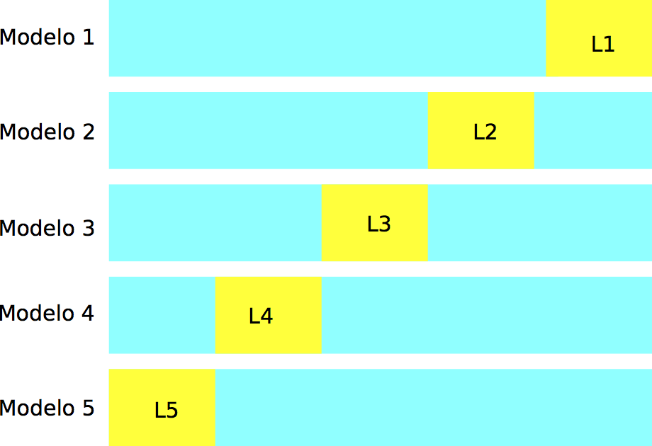
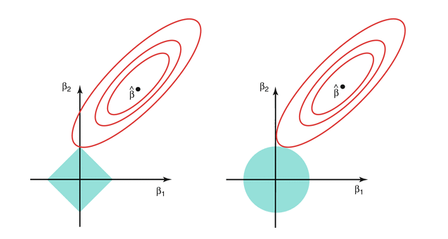

# Regularización

```{r, include = FALSE}
library(tidyverse)
cbbPalette <- c("#000000", "#E69F00", "#56B4E9", "#009E73", "#F0E442", "#0072B2", "#D55E00", "#CC79A7")
theme_set(theme_minimal())
```

Los métodos para ajustar modelos lineales que vimos en secciones anteriores
(mínimos cuadrados y minimización de devianza)

## Sesgo y varianza de predictores


Consideremos el problema de regresión, donde el proceso que genera los
datos está dado por
$$Y = f(X) + \epsilon$$

Consideremos que queremos hacer predicciones para una $X=x_0$ particular, de modo
que el error es

$$Y - \hat{f}(x_0) = (f(x_0) - \hat{f}(x_0)) + \epsilon$$
Como discutimos antes, no podemos hacer nada por la variación de $\epsilon$ (a menos que incluyamos otros predictores $X$ informativos, por ejemplo).
La pregunta es entonces ¿por qué podría pasar que $\hat{f}(x_0)$ estuviera lejos
de $f(x_0)$? Recordemos que $\hat{f}(x_0)$ depende de una muestra
de entrenamiento ${\mathcal L}$, de modo que:

- Puede ser que $\hat{f}(x_0)$ está consistentemente lejos de $f(x_0)$, independientemente
de cuál es la muestra de entrenamiento.
- Puede ser que $\hat{f}(x_0)$ varía mucho dependiendo de la muestra de entrenamiento,
y en consecuencia es poco probable que $\hat{f}(x_0)$ esté cerca de  $f(x_0)$.

Es posible demostrar que 

$$E\left ( (f(x_0)-\hat{f}(x_0))^2   \right) =
(f(x_0) - E(\hat{f}(x_0)))^2 + Var (\hat{f}(x_0))$$

donde los valores esperados y varianza son sobre posibles muestras de entrenamiento.
Al primer término le llamamos **sesgo** : Qué tan lejos en promedio están las estimaciones
de nuestro modelo del verdadero valor, y al segundo término le llamamos
**varianza**: qué tanto varían las estimaciones del modelo. Ambas pueden
ser razones por las que obtengamos predicciones malas.


#### Ejemplo {-}

Consideremos dos métodos: regresión lineal y regresión polinomial (pensemos
que es un tipo de ajuste de curvas). Para ilustrar los conceptos de sesgo
y varianza simularemos varios posibles muestras de entrenamiento:


```{r, fig.width=5, fig.asp=0.7}
f <- function(x){ sin(4 * x) }
sim_data <- function(n = 30){
  x <- runif(n, 0, 1)
  y <- f(x) + rnorm(n, 0, 0.5)
  data_frame(x = x, y = y)
}
dat <- sim_data(n = 100)
ggplot(dat, aes(x = x, y = y)) + geom_point()
```

```{r}
set.seed(92142)
sims <- data_frame(rep = 1:10)
sims <- sims %>% group_by(rep) %>% 
  mutate(data = list(data = sim_data())) %>% unnest
```

Regresión lineal en $x$ nos da diferencias consistentes entre predicciones
y observaciones (es un método que sufre de sesgo):

```{r}
ggplot(sims, aes(x=x, y=y)) + geom_point() +
  facet_wrap(~rep) + 
  geom_smooth(formula = y~x, method ='lm', colour = 'red', se = FALSE) +
  ylim(c(-3,3))
```

Mientras que regresión polinomial nos da diferencias variables y grandes
entre predicciones y observaciones (es un método que sufre de varianza):

```{r}
ggplot(sims, aes(x=x, y=y)) + geom_point() +
  facet_wrap(~rep) + geom_smooth(formula = y~ poly(x, 9, raw = TRUE), method ='lm', 
                                 colour = 'red', se = FALSE) + ylim(c(-3,3))
```

Podemos ver todos los modelos una misma gráfica y apreciar mejor la
variación entre ellos:

```{r, fig.width=5, fig.asp=0.7}
ggplot(sims, aes(x = x, y = y, group = rep)) + 
    geom_smooth(formula = y~ poly(x, 9, raw = TRUE), method ='lm', 
                                 colour = 'grey40', se = FALSE) + 
    geom_smooth(formula = y~x, method ='lm', colour = 'red', se = FALSE)
```

En este ejemplo, ambos métodos se desempeñan mal, pero por razones distintas.
El primer método sufre más de sesgo (subajuste): es un método rígido que no aprende de patrones
en los datos. El segundo método sufre más de varianza (sobreajuste): es un método flexible que aprende
ruido. Cada uno de estos problemas requiere soluciones diferentes. 

Típicamente, reducciones en sesgo producen incrementos potenciales
de varianza, y reducciones en varianza tienden a producir incrementos
potenciales de sesgo.
En esta parte veremos métodos de *regularización*, que sirven para reducir la
varianza. Esta reducción en varianza será exitosa cuando el costo en sesgo
que paguemos sea menor que esta reducción.

### Sesgo y varianza en modelos lineales

Aunque típicamente pensamos que los modelos lineales son métodos simples, con
estructura rígida, y que tienden a sufrir más por sesgo que por varianza (parte de 
la razón por la que existen métodos más flexibles como bosques aleatorios, redes
nueronales, etc.), hay varias razones por las que los métodos lineales pueden sufrir
de varianza alta:

- Cuando la muestra de entrenamiento es relativamente chica ($N$ chica), la varianza
puede ser alta.

- Cuando el número de entradas  $p$ es grande, podemos también sufrir de varianza grande
(pues tenemos muchos parámetros para estimar).

- Cuando hay variables correlacionadas en las entradas la varianza también puede ser alta.

En estos casos, conviene buscar maneras de reducir varianza - generalmente a costa
de un incremento de sesgo.

#### Ejemplo {-}


Consideramos regresión logística. En primer lugar, supondremos que 
tenemos un problema con $n=400$ y $p=100$, y tomamos como modelo para los datos (sin 
ordenada al origen):

$$p_1(x)=h\left(\sum_{j=1}^{100} \beta_j x_j\right ),$$


donde $h$ es la función logística. 
Nótese que este es el *verdadero modelo para los datos*. Para producir datos
de entrenamiento, primero generamos las betas fijas, y después, utilizando estas betas,
generamos 400 casos de entrenamiento.

Generamos las betas:

```{r}
h <- function(x){ 1 / (1 + exp(-x))}
set.seed(2805)
beta <- rnorm(100,0,0.1)
names(beta) <- paste0('V', 1:length(beta))
head(beta)
```

Con esta función simulamos datos de entrenamiento (400) y datos
de prueba (5000).

```{r}
sim_datos <- function(n, m, beta){
  p <- length(beta)
  #n = casos de entrenamiento, m= casos de prueba, p=num variables
  mat <- matrix(rnorm((n+m)*p, 0, 0.5), n+m, p) + rnorm(n + m) 
  prob <- h(mat %*% beta) 
  y <- rbinom(n + m, 1, prob)
  dat <- as.data.frame(mat)
  dat$y <- y
  dat$entrena <- FALSE
  dat$entrena[1:n] <- TRUE
  dat
}
set.seed(9921)
datos <- sim_datos(n = 400, m = 2000, beta = beta)
```

Y ahora ajustamos el modelo de regresión logística:

```{r}
mod_1 <- glm(y ~ -1 + ., datos %>% filter(entrena) %>% select(-entrena), 
             family = 'binomial')
```

¿Qué tan buenas fueron nuestras estimaciones?

```{r}
qplot(beta, mod_1$coefficients) + 
  xlab('Coeficientes') + 
  ylab('Coeficientes estimados') +
  geom_abline(intercept=0, slope =1) +
  xlim(c(-1.5,1.5))+ ylim(c(-1.5,1.5))
```

Y notamos que las estimaciones no son buenas.
Podemos hacer otra simulación para confirmar que el problema
es que las estimaciones son muy variables.

Con otra muestra de entrenamiento, vemos que las estimaciones tienen
varianza alta.
```{r}
datos_2 <- sim_datos(n = 400, m = 10, beta = beta)
mod_2 <- glm(y ~ -1 + ., datos_2 %>% filter(entrena) %>% select(-entrena), 
             family = 'binomial')
qplot(mod_1$coefficients, mod_2$coefficients) + xlab('Coeficientes mod 1') + 
  ylab('Coeficientes mod 2') +
  geom_abline(intercept=0, slope =1) +
  xlim(c(-1.5,1.5))+ ylim(c(-1.5,1.5))
```

Si repetimos varias veces:
```{r}
dat_sim <- lapply(1:50, function(i){
  salida <- sim_datos(n=400, m=10, beta)
  mod <-  glm(y ~ -1 + ., salida %>% filter(entrena) %>% select(-entrena), 
             family = 'binomial')
  data_frame(rep = i, vars = names(coef(mod)), coefs = coef(mod))
}) %>% bind_rows
head(dat_sim)
```

Vemos que hay mucha variabilidad en la estimación de los coeficientes
 (en rojo están los verdaderos):

```{r}
dat_sim <- dat_sim %>% mutate(vars = reorder(vars, coefs, mean))
ggplot(dat_sim, aes(x=vars, y=coefs)) + geom_boxplot() +
  geom_line(data=data_frame(coefs=beta, vars=names(beta)), 
    aes(y=beta, group=1), col='red',size=1.1) + coord_flip()
```

En la práctica, nosotros tenemos una sola muestra de entrenamiento.
Así que, con una muestra de tamaño $n=500$ como en este ejemplo,
obtendremos típicamente resultados no muy buenos. **Estos
coeficientes ruidosos afectan nuestras predicciones de manera negativa**.

Vemos ahora lo que pasa con nuestra $\hat{p}_1(x)$ estimadas, comparándolas
con $p_1(x)$, para la primera simulación:

```{r}
dat_e <- datos %>% filter(entrena)
dat_p <- datos %>% filter(!entrena)
x_e <- dat_e %>% select(-entrena, -y) %>% as.matrix
x_p <- dat_p %>% select(-entrena, -y) %>% as.matrix
p_entrena <- data_frame(prob_hat_1 = (mod_1$fitted.values), 
                        prob_1 = as.numeric(h(x_e %*% beta)),
                        clase = dat_e$y)
p_prueba <- data_frame(prob_hat_1 = as.numeric(h(x_p %*% (mod_1$coefficients))), 
                       prob_1 = as.numeric(h(x_p %*% beta)),
                       clase = dat_p$y)
```
Para los datos de entrenamiento:
```{r}
ggplot(p_entrena, aes(x=prob_hat_1, y=prob_1, colour=factor(clase))) + geom_point() + coord_flip()
```

Notamos en esta gráfica:

- El ajuste parece discriminar bien entre las dos clases del
conjunto de entrenamiento
(cuando la probabilidad estimada es chica, observamos casi todos clase 0,
y cuando la probabilidad estimada es grande, observamos casi todos clase 1).
- Sin embargo, vemos que las probabilidades estimadas tienden a ser extremas: muchas veces estimamos probabilidad cercana a 0 o 1, cuando la probabilidad real no es tan extrema (por ejemplo, está entre 0.25 y 0.75).

Estos dos aspectos indican sobreajuste. Podemos verificar comparando
con los resultados que obtenemos con la muestra de prueba.

Si calculamos la matriz de confusión y 
sensibilidad y especifidad *de entrenamiento*:

```{r}
tab <- table(p_entrena$prob_hat_1 > 0.5, p_entrena$clase)
tab
prop.table(tab, margin=2)
```

Pero con la muestra de prueba obtenemos

```{r}
tab <- table(p_prueba$prob_hat_1 > 0.5, p_prueba$clase)
tab
prop.table(tab, margin=2)
```

Que es un desempeño pobre comparado con lo que la muestra 
de entrenamiento podría indicar. 

Finalmente, podemos también repetir la
gráfica de arriba con los datos de prueba:


```{r}
ggplot(p_prueba, aes(x=prob_hat_1)) + 
    geom_point(aes(y=prob_1, colour=factor(clase))) + coord_flip()
```

Si la estimación fuera perfecta, 
esta gráfica sería una diagonal. Vemos entonces
que 

- Cometemos errores grandes en la estimación de probabilidades. 
- El desempeño predictivo del modelo es pobre, aún cuando nuestro modelo
puede discriminar razonablemente bien las dos clases en el conjunto de entrenamiento.

El problema no es que nuestro modelo no sea apropiado
(logístico), pues ese es el modelo real. El problema es 
el sobreajuste asociado a la variabilidad de los coeficientes
que notamos arriba.


### Reduciendo varianza de los coeficientes

Como el problema es la varianza, podemos atacar este problema
poniendo restricciones a los coeficientes, de manera que caigan en rangos 
más aceptables.  Una manera de hacer esto es sustituir el problema de minimización
de regresión logística, que es minimizar la devianza:

$$\min_{\beta} D(\beta)$$

con un problema penalizado

$$\min_{\beta} D(\beta) + \lambda\sum_{i=1}^p \beta_j^2$$

escogiendo un valor apropiado de $\lambda$.  

Si escogemos un valor
relativamente grande de $\lambda$, entonces terminaremos con una solución
donde los coeficientes $\beta_j$ no pueden alejarse mucho de 0, 
y esto previene parte del sobreajuste que observamos en nuestro primer ajuste. Otra manera de decir esto es: intentamos minimizar la devianza, pero no permitimos que los coeficientes se alejen demasiado de cero.

También es posible poner restricciones
sobre el tamaño de $\sum_{i=1}^p \beta_j^2$, lo cual es equivalente al problema
de penalización.

En este caso obtenemos (veremos más del paquete *glmnet*):

```{r, warning=FALSE, message=FALSE}
library(glmnet)
mod_restringido <- glmnet(x = x_e, y = dat_e$y, 
  alpha = 0,
  family='binomial', intercept = F, 
  lambda = 0.1)
beta_penalizado <- coef(mod_restringido)[-1] # quitar intercept
```

Y podemos ver que el tamaño de los coeficientes se redujo considerablemente:

```{r}
sum(beta_penalizado^2)
sum(coef(mod_1)^2)
```

Los nuevos coeficientes estimados tienen menor variación:
```{r}
qplot(beta, beta_penalizado) + 
  xlab('Coeficientes') + 
  ylab('Coeficientes estimados') +
  geom_abline(intercept=0, slope =1) +
  xlim(c(-0.5,0.5))+ ylim(c(-0.5,0.5))
```

Y las probabilidades estimadas son más razonables:

```{r}
p_entrena$prob_hat_pen <- h(x_e %*% as.numeric(beta_penalizado))
p_prueba$prob_hat_pen <- h(x_p %*% as.numeric(beta_penalizado))
```

```{r}
ggplot(p_entrena, aes(x=prob_1, y=prob_hat_pen, colour=factor(clase))) + 
    geom_point() 
```

El desempeño es considerablemente mejor:

```{r}
tab <- table(p_prueba$prob_hat_pen > 0.5, p_prueba$clase)
prop.table(tab, 2)
```

Y finalmente, comparamos las curvas ROC de prueba para los
dos modelos, el penalizado y el no penalizado. El modelo penalizado
es considerablemente mejor:

```{r, warning=FALSE, message =FALSE}
library(ROCR)
pred <- prediction(predictions = p_prueba$prob_hat_1, labels = p_prueba$clase)
perf <- performance(pred, measure = "sens", x.measure = "fpr") 
plot(perf)
pred_r <- prediction(predictions = p_prueba$prob_hat_pen, labels = p_prueba$clase)
perf_r <- performance(pred_r, measure = "sens", x.measure = "fpr") 
plot(perf_r, add =T, col ='red')
abline(a=0, b=1, col ='gray')
```


**Observación**: Sin embargo, vemos que en la muestra de entrenamiento se desempeña mejor
el modelo sin penalización, como es de esperarse (el mínimo irrestricto es
más bajo que el mínimo del problema con restricción).


```{r}
library(ROCR)
pred <- prediction(predictions = p_entrena$prob_hat_1, labels = p_entrena$clase)
perf <- performance(pred, measure = "sens", x.measure = "fpr") 
plot(perf)
pred_r <- prediction(predictions = p_entrena$prob_hat_pen, labels = p_entrena$clase)
perf_r <- performance(pred_r, measure = "sens", x.measure = "fpr") 
plot(perf_r, add =T, col ='red')
abline(a=0, b=1, col ='gray')
```


## Regularización ridge

Arriba vimos un ejemplo de regresión penalizada tipo **ridge**. Recordemos
que para regresión lineal, buscábamos minimizar la cantidad
$$D(\beta)=\frac{1}{n}\sum_{i=1}^n (y_i -\beta_0 - \sum_{j=1}^p \beta_j x_{ij})^2$$
y en regresión logística,
$$D(\beta)=-\frac{2}{n}\sum_{i=1}^n y_i \log(h(\beta_0 + \sum_{j=1}^p \beta_j x_{ij})) + (1-y_i) \log(1 - h(\beta_0 + \sum_{j=1}^p \beta_j x_{ij}))    ,$$
donde los denotamos de la misma forma para unificar notación.

```{block2, type='comentario'}
En regresión **ridge** (lineal/logística), para $\lambda>0$ fija minimizamos
$$D_{\lambda}^{ridge} (\beta)=D(\beta)  + \lambda\sum_{i=1}^p \beta_j^2,$$
donde suponemos que las entradas están estandarizadas (centradas y escaladas por
la desviación estándar).
```

#### Observaciones {-}


- La idea de regresión penalizada consiste en estabilizar la estimación de los
coeficientes, especialmente en casos donde tenemos muchas variables en relación
a los casos de entrenamiento. La penalización no permite que varíen tan fuertemente
los coeficientes.
- Cuando $\lambda$ es mas grande, los coeficientes se encogen más fuertemente
hacia cero con respecto al problema no regularizado. En este caso, estamos
**reduciendo la varianza** pero potencialmente **incrementando el sesgo**.
- Cuando $\lambda$ es mas chico, los coeficientes se encogen menos fuertemente
hacia cero, y quedan más cercanos a los coeficientes de mínimos cuadrados/máxima verosimilitud. 
En este caso, estamos
**reduciendo el sesgo** pero **incrementando la varianza**.
- Nótese que no penalizamos $\beta_0$. Es posible hacerlo, pero típicamente
no lo hacemos. En regresión lineal, de esta forma garantizamos que 
la predicción $\hat{y}$, cuando todas las variables $x_j$ toman su valor
en la media, es el promedio de las $y_i$'s de entrenamiento. Igualmente en 
regresión logística, la probabilidad ajustada cuando las entradas toman su
valor en la media es igual a $h(\beta_0)$.
- Que las variables estén estandarizadas es importante para que tenga
sentido la penalización. Si las variables $x_j$ están en distintas escalas (por ejemplo
pesos y dólares), entonces también los coeficientes $\beta_j$ están en distintas escalas,
y una penalización fija no afecta de la misma forma a cada coeficiente.


Resolver este problema penalizado por descenso en gradiente no tienen dificultad, pues:

```{block2, type='comentario'}
$$\frac{\partial D_{\lambda}^{ridge} (\beta)}{\partial\beta_j} = \frac{\partial D(\beta)}{\beta_j} + 2\lambda\beta_j$$
para $j=1,\ldots, p$, y 
$$\frac{\partial D_{\lambda}^{ridge} (\beta)}{\partial\beta_0} = \frac{\partial D(\beta)}{\beta_0}.$$
```

De forma que sólo hay que hacer una modificación  mínima al algoritmo de descenso en gradiente
para el caso no regularizado.

### Selección de coeficiente de regularización

Seleccionamos $\lambda$ para minimizar el error de predicción,
es decir, para mejorar nuestro modelo ajustado en cuanto a sus 
predicciones.

- No tiene sentido intentar escoger $\lambda>0$ usando el error
de entrenamiento. La razón es que siempre que aumentamos $\lambda$, obtenemos
un valor mayor de la suma de cuadrados / devianza del modelo, pues $\lambda$ más
grande implica que pesa menos la minimización de la suma de cuadrados /devianza
en el problema de la minimización. En otras palabras, los coeficientes tienen
una penalización más fuerte, de modo que el mínimo que se alcanza es mayor
en términos de devianza.
- Intentamos escoger $\lambda$ de forma que se minimice el error de predicción,
o el error de prueba (que estima el error de predicción).

#### Ejemplo (simulación) {-}

Regresamos a nuestro problema original simulado de clasificación. La función *glmnet*
se encarga de estandarizar variables y escoger un rango adecuado de
penalizaciones $\lambda$. La función *glmnet* ajusta varios modelos (parámetro
*nlambda*) para un rango amplio de penalizaciones $\lambda$:


```{r}
library(glmnet)
mod_ridge <- glmnet(x = x_e, y = dat_e$y, 
  alpha = 0, #ridge
  family = 'binomial', intercept = F, nlambda=50) #normalmente ponemos intercept = T
dim(coef(mod_ridge))

```

En primer lugar, observamos cómo se encogen los coeficientes para
distintos valores de $\lambda$:
```{r}
plot(mod_ridge, xvar='lambda')
```

Para escoger el valor adecuado de $\lambda$, calculamos la devianza 
bajo la muestra de prueba:

```{r}
devianza  <- function(p, y){
  -2*mean(y * log(p) + (1-y) * log(1 - p))
}
# predict en glmnet produce probabilidades para los 50 modelos
preds_ridge <- predict(mod_ridge, newx = x_p, type = 'response') %>%
  data.frame %>% mutate(id = 1:nrow(x_p)) %>%
  gather(modelo, prob, -id) %>%
  left_join(dat_p %>% mutate(id=1:nrow(dat_p)) %>% select(id, y))

head(preds_ridge)
tail(preds_ridge)

df_lambdas <- data_frame(modelo = attr(mod_ridge$a0, 'names'), 
                         lambda = mod_ridge$lambda)


devianzas_prueba <- preds_ridge %>% group_by(modelo) %>%
  summarise( devianza = devianza(prob, y)) %>% left_join(df_lambdas)

ggplot(devianzas_prueba, aes(x = lambda, y= devianza)) + 
  scale_x_log10(breaks = round(2^seq(-5,5,1),2)) +
  geom_point()
```

Buscamos entonces minimizar la devianza (evaluada en la muestra de prueba),
que corresponde a tomar un valor de $\lambda$ alrededor de 0.5, por ejemplo

**Discusión**: ¿por qué la devianza de prueba tiene esta forma, que es
típica para problemas de regularización? 


El modelo final queda como sigue:

```{r}
df_lambdas 
coefs_selec <- coef(mod_ridge)[-1, 's35']
pred_prueba_final <- h(x_p %*% coefs_selec)
tab_confusion <- table(pred_prueba_final > 0.5, dat_p$y)
tab_confusion
prop.table(tab_confusion, margin=2)
```


#### Ejemplo: variables correlacionadas {-}

Ridge es efectivo para reducir varianza inducida por variables correlacionadas.
Consideramos el siguiente ejemplo donde queremos predecir el
porcentaje de grasa corporal a partir de varias medidas del cuerpo (estas medidas están claramente correlacionadas):

```{r, warning=FALSE, message=FALSE}
dat_grasa <- read_csv(file = '../datos/bodyfat.csv')
head(dat_grasa)
nrow(dat_grasa)
set.seed(127)
dat_grasa$unif <- runif(nrow(dat_grasa), 0, 1)
dat_grasa <- arrange(dat_grasa, unif)
dat_grasa$id <- 1:nrow(dat_grasa)
bfat_e <- dat_grasa[1:100,]
bfat_p <- dat_grasa[101:252,]
```
```{r}
xbf_e <- bfat_e %>% select(estatura, peso, abdomen, muslo, biceps) %>% as.matrix
cor(xbf_e)
```

Ahora ajustamos varios modelos penalizamos, y observamos qué
pasa con los coeficientes conforme aumentamos la penalización:

```{r}
ridge_bodyfat <- glmnet(x = scale(xbf_e), y = bfat_e$grasacorp, alpha=0, 
                        lambda = exp(seq(-5, 5, 0.25)))
plot(ridge_bodyfat, xvar = 'lambda', label=TRUE)
```

Donde notamos que las variables con correlaciones altas se "encogen" juntas
hacia valores similares conforme aumentamos la constante de penalización $\lambda$.
Nótese que para regularización muy baja peso y abdomen por ejemplo, tienen
signos opuestos y valores altos: esto es posible pues tienen correlación alta,
de modo que la función de predicción está pobremente determinada: hay un espacio
grande de pares de parámetros que dan predicciones similares, y esto resulta
en coeficientes con varianza alta y predicciones inestables y ruidosas.

- Nótese, adicionalmente, que los coeficientes parecen tener más sentido en relación
al problema con regularización. Regularización, en este tipo de problemas, es una
de las componentes necesarias (pero no suficiente) para ir hacia interpretación
del fenómeno que nos interesa.


## Entrenamiento, Validación y Prueba

El enfoque que vimos arriba, en donde dividemos la muestra en dos
partes al azar, es la manera más fácil de seleccionar modelos. En general,
el proceso es el siguiente:

- Una parte con los que ajustamos todos
los modelos que nos interesa. Esta es la **muestra de entrenamiento**
- Una parte como muestra de prueba, con el que evaluamos el desempeño
de cada modelo ajustado en la parte anterior. En este contexto, 
a esta muestra se le llama **muestra de validación}**.
- Posiblemente una muestra adicional independiente, que 
llamamos **muestra de prueba**, con la que hacemos una evaluación
final del modelo seleccionado arriba. Es una buena idea 
apartar esta muestra si el proceso de validación incluye muchos métodos
con varios parámetros afinados (como la $\lambda$ de regresión ridge).

```{r, out.width=450}

```

Cuando tenemos datos abundantes, este enfoque es el usual. Por ejemplo,
podemos dividir la muestra en 50-25-25 por ciento. Ajustamos modelos
con el primer 50\%, evaluamos y seleccionamos con el segundo 25\% y finalmente,
si es necesario, evaluamos el modelo final seleccionado con la muestra 
final de 25\%. 

La razón de este proceso es que así podemos ir y venir entre
entrenamiento y validación, buscando mejores enfoques y modelos, y
no ponemos en riesgo la estimación final del error. (Pregunta: ¿por qué
probar agresivamente buscando mejorar el error de validación podría
ponder en riesgo la estimación final del error del modelo seleccionado? )

### Validación cruzada

En muchos casos, no queremos apartar una muestra de validación para seleccionar modelos,
pues no tenemos muchos datos (al dividir la muestra obtendríamos
un modelo relativamente malo en relación al que resulta de todos los datos).
Un criterio para seleccionar la regularización adecuada
es el de **validación cruzada*, que es un método computacional
para producir una estimación interna (usando sólo muestra de entrenamiento)
del error de predicción.


En validación cruzada (con $k$ vueltas), 
construimos al azar una partición, con tamaños similares, de la muestra de entrenamiento
${\mathcal L}=\{ (x_i,y_i)\}_{i=1}^n$:

$$ {\mathcal L}={\mathcal L}_1\cup {\mathcal L}_2\cup\cdots\cup {\mathcal L}_k.$$

```{r, out.width=320}

```

Construimos $k$ modelos distintos, digamos $\hat{f}_j$, usando solamente
la muestra ${\mathcal L}-{\mathcal L}_j$, para $j=1,2,\ldots, k$. Cada uno de estos modelos lo evaluamos
usando la parte que no usamos para entrenarlo, ${\mathcal L}_j$, 
para obtener una 
estimación honesta del error del modelo $\hat{f}_k$, a la que denotamos
por $\hat{e}_j$. 

Notemos entonces que tenemos $k$ estimaciones del error
$\hat{e}_1,\ldots, \hat{e}_k$, una para cada uno de los modelos que construimos.
La idea ahora es que

- Cada uno de los modelos $\hat{f}_j$ es similar al modelo ajustado
con toda la muestra $\hat{f}$, de forma que podemos pensar
que cada una de las estimaciones $\hat{e}_j$ es un estimador del error de $\hat{f}$.
- Dado el punto anterior, podemos construir una mejor estimación
promediando las $k$ estimaciones anteriores, para obtener:
$$\widehat{cv} = \frac{1}{k} \sum_{j=1}^k \hat{e}_j.$$
- ¿Cómo escoger $k$? Usualmente se usan $k=5,10,20$, y $k=10$ es el más popular.
La razón es que cuando $k$ es muy chico, tendemos a evaluar modelos construidos
con pocos datos (comparado al modelo con todos los datos de entrenamiento). Por otra
parte, cuando $k$ es grande el método puede ser muy costoso (por ejemplo, si 
$k=N$, hay que entrenar un modelo para cada dato de entrada).


Por ejemplo, el paquete *glmnet* incluye la función
*cv.glmnet*, que hace los $k$ ajustes para cada una
de las lambdas:

```{r}
library(glmnet)
set.seed(291)
cv_mod_ridge <- cv.glmnet(x = x_e, y=dat_e$y, 
  alpha = 0,
  family='binomial', intercept = F, nfolds = 10, nlambda=50)
plot(cv_mod_ridge)
cv_mod_ridge$lambda.min
cv_mod_ridge$lambda.1se
```

Nótese que la estimación del error de predicción por validación
cruzada incluye un error de estimación (intervalos). Esto nos
da dos opciones para escoger la lambda final:

- Escoger la que de el mínimo valor de error por validación cruzada
- Escoger la lambda más grande *que no esté a más de 1 error estándar
del mínimo.*

En la gráfica anterior se muestran las dos posibilidades. La razón del segundo
criterio es tomar el modelo más simple que tenga error consistente con el
mejor modelo.


### ¿Cómo se desempeña validación cruzada como estimación del error?
```{r}
cross_valid <- tibble(devianza_cv = cv_mod_ridge$cvm,
                          modelo = attr(cv_mod_ridge$glmnet.fit$a0, 'names')[1:50])

devs <- devianzas_prueba %>% left_join(cross_valid) %>%
  rename(devianza_prueba = devianza) %>%
  gather(tipo, devianza,  devianza_prueba, devianza_cv)

ggplot(devs, aes(x=log(lambda), y=devianza, colour=tipo)) +
  geom_point()
```


Vemos que la estimación en algunos casos no es tan buena, aún cuando
todos los datos fueron usados. Pero el mínimo se encuentra en lugares
muy similares. 

La razón es que validación cruzada en realidad considera 
perturbaciones del conjunto de entrenamiento, de forma que lo que 
intenta evaluar es el error producido, para cada lambda, **sobre 
distintas muestras de entrenamiento**.

En realidad nosotros queremos evaluar el error de predicción del
modelo que ajustamos. Validación cruzada es más un estimador
del error esperado de predicción sobre los modelos que ajustaríamos
con distintas muestras de entrenamiento.

El resultado es que:

- Usamos validación cruzada para escoger la complejidad adecuada
de la familia de modelos que consideramos.
- Como estimación del error de predicción del modelo que ajustamos,
validación cruzada es más seguro que usar el error de entrenamiento, que
muchas veces puede estar fuertemente sesgado hacia abajo. Sin embargo, lo
mejor en este caso es utilizar una muestra de prueba.

### Ejercicio {-}

Consideremos el ejemplo de reconocimiento de dígitos y regresión logística multinomial.

```{r, message=FALSE, warning=FALSE}
library(readr)
digitos_entrena <- read_csv('../datos/zip-train.csv')
digitos_prueba <- read_csv('../datos/zip-test.csv')
names(digitos_entrena)[1] <- 'digito'
names(digitos_entrena)[2:257] <- paste0('pixel_', 1:256)
names(digitos_prueba)[1] <- 'digito'
names(digitos_prueba)[2:257] <- paste0('pixel_', 1:256)
```

Vamos a correr modelos con varias lambda, y estimar su error 
con validación cruzada:

```{r}
set.seed(2912)
if(TRUE){
  digitos_entrena_s <- sample_n(digitos_entrena, size = 2000)
} else {
  digitos_entrena_s <- digitos_entrena
}
x_e <- digitos_entrena_s %>% select(-digito) %>% as.matrix
x_p <- digitos_prueba  %>% select(-digito) %>% as.matrix
digitos_cv <- cv.glmnet(x = x_e, y = factor(digitos_entrena_s$digito), 
                        family = 'multinomial', alpha = 0, 
                        parallel = TRUE, nfolds = 10, lambda = exp(seq(-12, 2, 1)))
plot(digitos_cv)
```

Ahora hacemos predicciones para el conjunto de prueba, usando
la lambda que nos dio el menor error de validación cruzada:

```{r}
preds_prueba <- predict(digitos_cv, newx = x_p, s = 'lambda.min')[,,1] # solo un grupo de coeficientes
dim(preds_prueba)
```

Y evaluamos la tasa de clasificación incorrecta:

```{r}
preds_clase <- apply(preds_prueba, 1, which.max)
table(preds_clase, digitos_prueba$digito)
mean(preds_clase -1 != digitos_prueba$digito)
```

Este modelo mejora considerablemente al modelo sin regularización.

**Observación**: Cuando vimos regresión multinomial, la última clase es
uno menos la suma del resto de probabilidades de clase ($(K-1)(p+1)$ parámetros).
La salida de glmnet,
sin embargo, tiene coeficientes para todas las clases ($K(p+1)$ parámetros). 
¿Por qué en regresión ridge no está sobreparametrizado el modelo? 

## Regularización lasso


Otra forma de regularización es el **lasso**, que en lugar de penalizar
con la suma de cuadrados en los coeficientes, penaliza por la suma
de su valor absoluto.

```{block2, type='comentario'}
En regresión **lasso** (lineal/logística), para $\lambda>0$ fija minimizamos
$$D_{\lambda}^2 (\beta)=D(\beta)  + \lambda\sum_{i=1}^p |\beta_j|$$,
donde suponemos que las entradas están estandarizadas (centradas y escaladas por
la desviación estándar).
```

El problema de minimización de ridge y de lasso se pueden reescribir como
problemas de restricción:


```{block2, type='comentario'}
En regresión **lasso** (lineal/logística), para $s>0$ fija minimizamos
$$D(\beta), $$
sujeto a
$$\sum_{i=1}^p |\beta_j|< s$$
donde suponemos que las entradas están estandarizadas (centradas y escaladas por
la desviación estándar).
```

```{block2, type='comentario'}
En regresión **ridge** (lineal/logística), para $t>0$ fija minimizamos
$$D(\beta), $$
sujeto a
$$\sum_{i=1}^p \beta_j^2 < t$$
donde suponemos que las entradas están estandarizadas (centradas y escaladas por
la desviación estándar).
```
$s$ y $t$ chicas corresponden a valores de penalización $\lambda$ grandes.


En un principio, puede parecer que ridge y lasso deben dar resultados
muy similares, pues en ambos casos penalizamos por el tamaño de los coeficientes.
Sin embargo, son distintos de una manera muy importante.

En la siguiente gráfica representamos las curvas de nivel de $D(\beta)$. 
Recordemos que en mínimos cuadrados o regresión logística intentamos minimizar
esta cantidad sin restricciones, y este mínimo se encuentra en el centro 
de estas curvas de nivel. Para el problema restringido, buscamos más
bien la curva de nivel más baja que intersecta la restricción:

```{r}

```
Y obsérvese ahora que la solución de lasso *puede hacer algunos coeficientes
igual a 0*. Es decir,

```{block2, type='comentario'}
En regresión ridge, los coeficientes se encogen gradualmente desde la solución
no restringida hasta el origen. Ridge es un método de **encogimiento de coeficientes.**

En regresión lasso, los coeficientes se encogen gradualmente, pero también
se excluyen  variables del modelo. Por eso lasso es un método de
*encogimiento y selección de variables*.
```

```{block2, type='comentario'}
- Regresión ridge es especialmente útil cuando tenemos varias variables de entrada
fuertemente correlacionadas. Regresión ridge intenta encoger juntos coeficientes de variables
correlacionadas para reducir varianza en las predicciones.
- Lasso encoge igualmente coeficientes para reducir varianza, pero también comparte
similitudes con *regresión de mejor subconjunto*, en donde para cada número de variables $l$
buscamos escoger las $l$ variables que den el mejor modelo. Sin embargo, el enfoque
de lasso es más escalable y puede calcularse de manera más simple.
- Descenso en gradiente no es apropiado para regresión lasso (ver documentación de
glmnet para ver cómo se hace en este paquete). El problema es que los coeficientes
nunca se hacen exactamente cero, pues la restricción no es diferenciable en el origen 
(coeficientes igual a cero).
```

#### Ejemplo {-}

Consideramos el ejemplo de bodyfat:

```{r, message=FALSE, warning=FALSE}
library(readr)
dat_grasa <- read_csv(file = '../datos/bodyfat.csv')
head(dat_grasa)
nrow(dat_grasa)
set.seed(127)
dat_grasa$unif <- runif(nrow(dat_grasa), 0, 1)
dat_grasa <- arrange(dat_grasa, unif)
dat_grasa$id <- 1:nrow(dat_grasa)
dat_e <- dat_grasa[1:150,]
dat_p <- dat_grasa[151:252,]

```

```{r}
x_e <- dat_e %>% select(-grasacorp, -id, -unif) %>% as.matrix
x_p <- dat_p %>% select(-grasacorp, -id, -unif) %>% as.matrix

mod_bodyfat_cv <- cv.glmnet(x = x_e, y = dat_e$grasacorp, alpha = 1) #alpha=1 para lasso
plot(mod_bodyfat_cv)
```

Veamos los coeficientes para un modelo regularizado con la $\lambda$
máxima con error consistente con el mínimo (por validación cruzada):

```{r}
coeficientes <- predict(mod_bodyfat_cv, s ='lambda.1se', type='coefficients')
coeficientes
```

Y nótese que este modelo solo incluye 4 variables. El error de predicción
es similar al modelo que incluye todas las variables, y terminamos
con un modelo considerablemente más simple:

```{r}
pred_prueba <- predict(mod_bodyfat_cv, newx = x_p, s ='lambda.1se')
sqrt(mean((pred_prueba-dat_p$grasacorp)^2))
```

La traza confirma que la regularización lasso, además de encoger 
coeficientes, saca variables del modelo conforme el valor de regularización
aumenta:

```{r}
mod_bodyfat <- glmnet(x = x_e, y = dat_e$grasacorp, alpha = 1) #alpha=1 para lasso
plot(mod_bodyfat, xvar = "lambda")
```


Comparado con regresión lineal:
```{r}
pred_prueba <- predict(lm(grasacorp ~., data = dat_e %>% select(-id, -unif)), newdata=dat_p)
sqrt(mean((pred_prueba-dat_p$grasacorp)^2))
```

