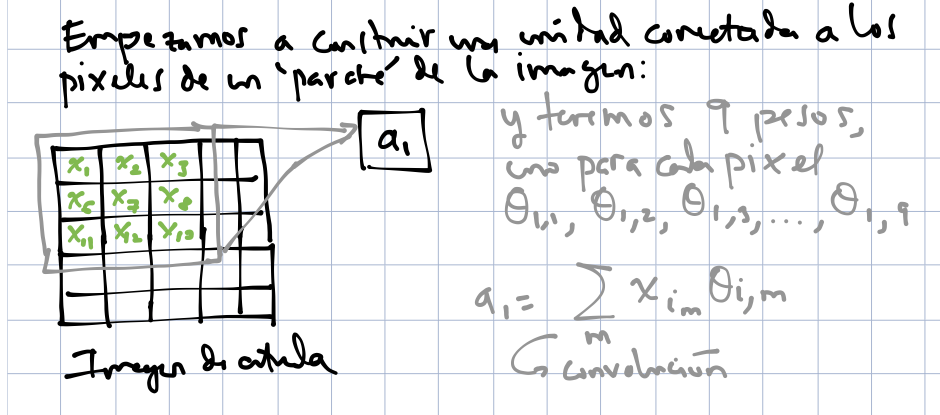
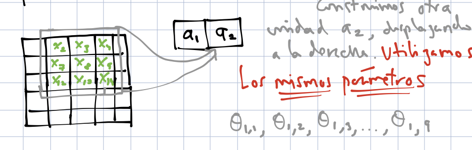
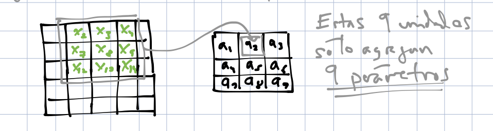
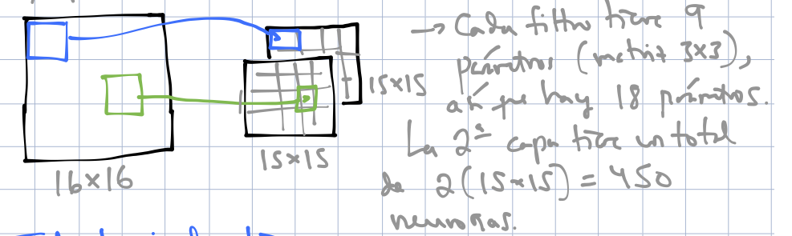
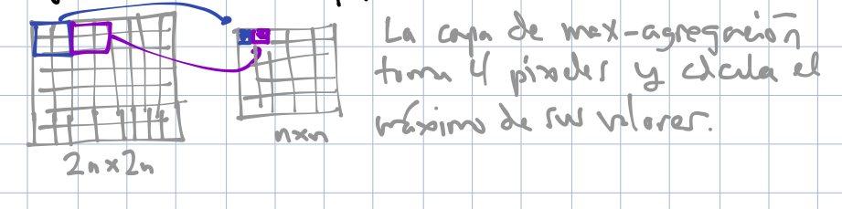
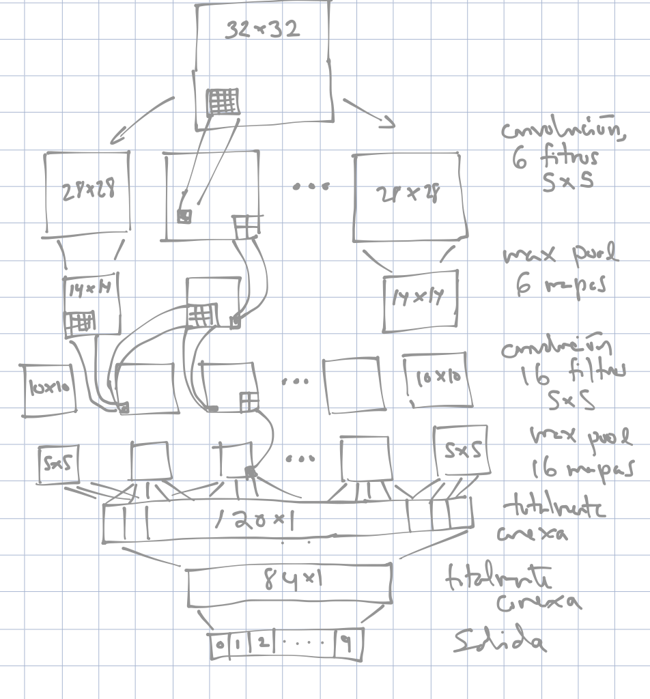

# Redes convolucionales

Las redes convolucionales son un tipo de arquitectura de red que utiliza
ciertos supuestos acerca de los pesos, en contraste a las redes totalmente
conexas donde los pesos pueden tomar cualquier valor. Esos supuestos
están adaptados para explotar la estructura señales, por ejemplo: sonido,  imágenes o texto
En estos casos,
se trata de entradas que tienen una **estructura adicional de proximidad**
(es decir, hay un concepto de pixeles cercanos y lejanos, igual de tiempos
cercanos o lejanos). Las redes convolucionales son la arquitectura más
exitosa para tratar con este tipo de problemas con estructura espacial o temporal.

Hay tres consecuencias básicos que se siguen del uso de convoluciones, que explicamos
primero intuitivamente:

- **Conexiones ralas**: existen unidades que solo están conectadas a una fracción
relativamente chica de las unidades de la capa anterior (en lugar de todas, como
en redes totalmente conexas). Por ejemplo: una unidad que busca detectar una forma
en una esquina de una imagen no necesita estar conectada a pixeles de otras partes
de la imagen.

- **Parámetros compartidos**: diferentes unidades tienen pesos compartidos. Por ejemplo:
una unidad que quiere detectar el sonido de cierto animal al principio de la grabación
puede utilizar los mismos pesos aplicados a otra parte de la grabación. Podemos 
"mover" el detector (con los mismos pesos) a lo largo de la grabación para ver en dónde detecta el sonido que nos interesa.

- **Equivarianza**: Una translación de una entrada (en tiempo o espacio), produce
una traslación equivalente en la salida. Por ejemplo, Si una unidad asociada a
la esquina superior derecha de una imagen detecta un número, entonces habrá otra
unidad que puede detectar el número en la esquina inferior.

Todas estas propiedades inducen estructura en comparación
con una red totalmente conexa. Cuando esa estructura es
la apropiada, no introduce sesgo adicional y reduce considerablemente la varianza y el tamaño de los modelos. El éxito de este tipo de redes (como las convolucionales) está en encontrar la estructura
apropiada para el problema que estamos tratando.

## Filtros convolucionales

### Filtros en una dimensión {-}
Comenzamos por considerar filtros para una serie de tiempo.

```{block2, type='comentario'}
Un **filtro** es una transformación de una señal que pretende extraer
ciertas características y suprimir otras.
```

Por ejemplo, consideramos la siguiente serie, y promedios móviles centrados
de longitud 5. Los promedios móviles filtran las componentes de frecuencia
alta (variaciones en tiempos cortos), y nos dejan con la variación de mayor
frecuencia:

```{r, fig.width=5, fig.asp=0.5, warning=FALSE, message=FALSE}
#install.packages("RcppRoll")
library(tidyverse)
library(RcppRoll)
library(gridExtra)
h <- function(x){ifelse(x>0,x,0)}
datos <- data_frame(t = 1:length(BJsales),
                    serie = as.numeric(BJsales) + rnorm(length(BJsales), 0, 10)) %>%
          mutate(promedio_mov = roll_mean(serie, 5, align='center', fill = NA))
ggplot(filter(datos, t < 100), aes(x=t, y=serie)) + geom_line() + 
  geom_line(aes(y=promedio_mov), colour='red', size=1.2)
```

Podemos escribir este filtro de la siguiente manera: si $x_t$ representa
la serie original, y $y_t$ la serie filtrada, entonces
$$ y_t = \frac{1}{5}(x_{t-2} + x_{t-1} + x_t + x_{t+1}+x_{t+2})$$

Podemos escribir esta operación poniendo
$$f =\frac{1}{5} (\ldots, 0,0,1,1,1,1,1,0,0,\ldots)$$

donde $f_s=1/5$ para $s=-2,-1,0,1,2$ y cero en otro caso.

Entonces
$$y_t = \cdots + x_{t-2}f_{-2} +    x_{t-1}f_{-1} +    x_{t}f_{0}   +x_{t+1}f_{1} +x_{t+2}f_{2}$$
Que también se puede escribir como
\begin{equation}
y_t = \sum_{s=-\infty}^{\infty} x_s f_{s-t}
\end{equation}
Nótese que estamos moviendo el filtro $f$ a lo largo de la serie (tiempo) y aplicándolo
cada vez.

**Observación**: en matemáticas y procesamiento de señales,
la *convolución* es más comunmente
\begin{equation}
y_t = \sum_{s=-\infty}^{\infty} x_s f_{t-s},
\end{equation}
mientras que la fórmula que nosotros usamos se llama *correlación cruzada*.
En redes neuronales se dice *filtro convolucional*, aunque estrictamente
usa la correlación cruzada (por ejemplo en Tensorflow).


Este es un ejemplo de **filtro convolucional** del tipo
que se usa en redes neuronales: es un vector $f$ que se aplica a la
serie $x$ como
en la ecuación anterior para obtener una serie transformada (filtrada) $y$. El vector se desplaza a lo largo de la serie par obtener los distintos valores filtrados.

Otro ejemplo son las primeras diferencias: la diferencia del valor actual menos el anterior. Este filtro toma
 valores altos cuando
la serie crece y bajos cuando decrece:

```{r}
datos <- datos %>% mutate(dif = promedio_mov - lag(promedio_mov)) 
ggplot(datos, aes(x=t, y=dif)) + geom_line() + geom_abline(slope=0, intercept=0)
```
¿Cuál es el filtro $f$ en este caso?

### Filtros convolucionales en dos dimensiones {-}

En dos dimensiones, nuestro filtro es una matriz $f_{i,j}$, que se aplica
a una matriz $x_{i,j}$ (podemos pensar que es una imagen) alrededor de cada
posible pixel,
para obtener la matriz (imagen) filtrada $y_{i,j}$ dada por

\begin{equation}
y_{a,b} = \sum_{s,t=-\infty}^{\infty} x_{s,t} f_{s-a,t-b}
\end{equation}

A la matriz $f$ se le llama matriz convolucional, kernel o  máscara del filtro

Por ejemplo, consideremos el filtro de 3x3
```{r}
filtro_difuminar <- matrix(rep(1 / 9, 9), 3, 3, byrow=T)
filtro_difuminar
```

El centro de este filtro se sobrepone sobre la cada pixel de la imagen $x$,
se multiplican los valores de la imagen por los del filtro y se suma
para obtener el nuevo pixel de la imagen $y$. 

¿Qué efecto tiene este filtro? Este filtro promedia los pixeles de un
parche de 3x3 de la imagen, o suaviza la imagen. Es el análogo en 2 dimensiones
del filtro de promedios móviles que vimos arriba.

```{r, message=FALSE, warning=FALSE}
library(imager)
estatua <- load.image('figuras/escultura.jpg') %>% grayscale
plot(estatua, axes=FALSE)
estatua_mat <- as.array(estatua)
dim(estatua_mat)
estatua_dif <- array(0, c(dim(estatua)[1]-1, dim(estatua)[2]-1, 1, 1))
# Ojo: esta manera es muy lenta: si necesitas convoluciones a mano busca
# paquetes apropiados
for(i in 2:dim(estatua_dif)[1]){
  for(j in 2:dim(estatua_dif)[2]){
    estatua_dif[i, j, 1, 1] <- sum(filtro_difuminar*estatua[(i-1):(i+1), (j-1):(j+1), 1, 1])
  }
}
plot(as.cimg(estatua_dif), axes=FALSE)
```


Podemos intentar otro filtro, que detecta bordes de arriba hacia abajo
(es decir, cambios de intensidad que van de bajos a altos conforme bajamos
en la imagen):


```{r}
filtro_borde <- (matrix(c(-1, -1, -1, 0, 0, 0, 1, 1, 1),  3, 3, byrow=T))
filtro_borde
estatua_filtrada <- array(0, c(dim(estatua_dif)[1]-1, dim(estatua_dif)[2]-1, 1, 1))
for(i in 2:dim(estatua_filtrada)[1]){
  for(j in 2:dim(estatua_filtrada)[2]){
    estatua_filtrada[i,j,1,1] <- sum(t(filtro_borde)*estatua_dif[(i - 1):(i + 1),(j - 1):(j + 1), 1, 1])
  }
}
plot(as.cimg(estatua_filtrada))
```

Este filtro toma valores altos cuando hay un gradiente de intensidad
de arriba hacia abajo.

¿Cómo harías un filtro que detecta curvas? Considera el siguiente ejemplo,
en donde construimos un detector de diagonales:


```{r, fig.width = 3}
library(keras)
mnist <- dataset_mnist()
digito <- t(mnist$train$x[10,,])
plot(as.cimg(digito))
filtro_diag <- matrix(rep(-1,25), 5, 5)
diag(filtro_diag) <- 2
for(i in 1:4){
  filtro_diag[i, i+1] <- 1
  filtro_diag[i+1, i] <- 1
}
filtro_diag_1 <- filtro_diag[, 5:1]
filtro_diag_1
digito_f <- array(0, c(dim(digito)[1]-2, dim(digito)[2]-2, 1, 1))
for(i in 3:dim(digito_f)[1]){
  for(j in 3:dim(digito_f)[2]){
    digito_f[i,j,1,1] <- sum((filtro_diag_1)*digito[(i-2):(i+2),(j-2):(j+2)])
  }
}
plot(as.cimg(digito_f))
```


## Filtros convolucionales para redes neuronales

En redes neuronales, la idea es que que qeremos aprender estos
filtros a partir de los datos. La imagen filtrada nos da las entradas
de la siguiente capa.

Entonces, supongamos que un filtro de 3x3 está dado por ciertos pesos

$$ 
f = \left[ {\begin{array}{ccccc}
\theta_{1,1} & \theta_{1,2} & \theta_{1,3} \\
\theta_{2,1} & \theta_{2,2} & \theta_{2,3} \\
\theta_{3,1} & \theta_{3,2} & \theta_{3,3} \\
\end{array} } \right]
$$


Este filtro lo aplicaremos a cada parche de la imagen de entrada. Empezamos
aplicando el filtro sobre la parte superior izquierda de la imagen para
calcular la primera unidad de salida $a_1$

```{r}

```

Ahora nos movemos un pixel a la derecha y aplicamos el filtro para
obtener la unidad $a_2$. Podemos poner las unidades en el orden de la imagen
para entender mejor las unidades:

```{r}

```

Al aplicar el filtro a lo  largo de toda la imagen, obtenemos 9 unidades
de salida:

```{r}

```


Finalmente, podemos agregar más parámetros para otros filtros:

```{r}

```


## Capas de agregación (pooling)

En procesamiento de imágenes y redes convolucionales también se utilizan
capas de pooling. Estas se encargan de resumir pixeles adyacentes. Una
de las más populares es el max pooling, donde en cada parche de la imagen
tomamos el máximo.

```{r}

```


Hay dos razones para usar estas agregaciones:

- Obtener invarianza a translaciones adicional (en un parche de la imagen,
solo importa si alguno de las unidades agregadas está activa para que el max-pooling
esté activo)
- Reduce el tamaño de la imagen (o de una capa de convolución) y en consecuencia
tenemos menos parámetros que tratar en las siguientes capas

## Capas convolucionales más profundas.

Después de hacer una primera capa convolucional como
la mostrada arriba, tendremos $k$ imágenes filtradas,
si utilizamos $k$ filtros. Podemos pensar que tenemos
estas $k$ imágenes apiladas una encima de otra. Las siguientes capas convolucionales funcionan filtran
la imágenes de esta pila (cada imagen filtrada tiene $k$ 
componentes).

Un filtro en la siguiente capa actúa sobre todas las componentes de la capa anterior, así que consiste de:

- Un juego de pesos (por ejemplo de 5x5) para cada una de las $k$ imágenes filtradas ($5\times5\times k$ nuevos filtros).
- Después de aplicar estos pesos a cada imagen filtrada correspondiente, sumamos pixel a pixel para obtener una nueva imagen filtrada
- Sumamos un sesgo.

Si esta segunda capa convolucional tiene $m$ filtros, entonces obtendremos $m$ imágenes filtradas.


## Ejemplo (arquitectura LeNet):

Las capas de pooling generalmente se aplican después de las convoluciones,
y hacia al final usamos capas totalmente conexas. Estas últimas capas
se encargan de combinar la información de las capas de convolución anteriores,
que detectan patrones simples, para obtener unidades que se encargan de
detectar patrones más complejos.

```{r}

```


```{r, message = FALSE, warning = FALSE, echo = FALSE}
library(readr)
set.seed(923)
digitos_entrena <- read_csv('../datos/zip-train.csv')
digitos_entrena <- digitos_entrena %>% sample_n(nrow(digitos_entrena))
digitos_prueba <- read_csv('../datos/zip-test.csv')
names(digitos_entrena)[1] <- 'digito'
names(digitos_entrena)[2:257] <- paste0('pixel_', 1:256)
names(digitos_prueba)[1] <- 'digito'
names(digitos_prueba)[2:257] <- paste0('pixel_', 1:256)
dim(digitos_entrena)
table(digitos_entrena$digito)
```

Ponemos el rango entre [0,1] (pixeles positivos) y usamos codificación dummy

```{r}
x_train <- digitos_entrena %>% select(contains('pixel')) %>% as.matrix + 1
x_train <- x_train/2 
dim(x_train) <- c(nrow(x_train), 16, 16, 1) 
x_train <- x_train %>% aperm(c(1,3,2,4))
x_test <- digitos_prueba %>% select(contains('pixel')) %>% as.matrix + 1
x_test <- x_test/2
dim(x_test) <- c(nrow(x_test), 16, 16, 1)
x_test <- x_test %>% aperm(c(1,3,2,4))
y_train <- to_categorical(digitos_entrena$digito, 10)
y_test <- to_categorical(digitos_prueba$digito, 10)
```

Para fines de interpretación, agregaremos regularización ridge además
de dropout (puedes obtener buen desempeño usando solamente dropout), 
y usaremos una arquitectura un poco más simple:

```{r, message=FALSE, warning=FALSE}
# reproducibilidad en keras es más difícil, pues hay varias capas de software
# set.seed no funciona. Podemos usar use_session_with_seed https://keras.rstudio.com/articles/faq.html#how-can-i-obtain-reproducible-results-using-keras-during-development
#
use_session_with_seed(72881)
usar_cache <- TRUE
if(!usar_cache){
    # correr modelo y guardarlo serializado
    #set.seed(213)
    lambda <- 0.005
    model_2 <- keras_model_sequential() 
    model_2 %>%
      layer_conv_2d(filters = 6, kernel_size = c(5, 5), 
                    activation = 'relu',
                    padding = 'same',
                    input_shape = c(16, 16, 1), 
                    kernel_regularizer = regularizer_l2(lambda),
                    name = 'conv_1') %>%
      layer_max_pooling_2d(pool_size = c(2, 2), name = "conv_1_down") %>% 
      layer_dropout(rate = 0.2) %>% 
      layer_conv_2d(filters = 4, kernel_size = c(3, 3), 
                    activation = 'relu',
                    kernel_regularizer = regularizer_l2(lambda),
                    name = 'conv_2') %>% 
      layer_max_pooling_2d(pool_size = c(2, 2), name = "conv_2_down") %>% 
      layer_dropout(rate = 0.2) %>% 
      layer_flatten() %>% 
      layer_dense(units = 30, activation = 'relu', 
                  kernel_regularizer = regularizer_l2(0.0001)) %>% 
      layer_dropout(0.2) %>% 
      layer_dense(units = 10, activation = 'softmax', 
                  kernel_regularizer = regularizer_l2(0.0001))
    
    model_2 %>% compile(
      loss = 'categorical_crossentropy',
      optimizer = optimizer_sgd(lr = 0.005,  momentum = 0.9, nesterov = TRUE),
      metrics = c('accuracy','categorical_crossentropy')
    )
    history <- model_2 %>% fit(
      x_train, y_train, 
      epochs = 300, batch_size = 64, 
      verbose = 0,
      validation_data = list(x_test, y_test)
    )
    model_serialized <- serialize_model(model_2)
    saveRDS(model_serialized, file= 'cache_obj/red_conv_ser.rds')
    
} else {
  # cargar modelo serializado
  model_serialized <- readRDS(file = 'cache_obj/red_conv_ser.rds')
  model_2 <- unserialize_model(model_serialized)
}
```

```{r}
score <- model_2 %>% evaluate(x_test, y_test)
score
score_entrena <- model_2 %>% evaluate(x_train, y_train)
score_entrena
```


### Conteo de parámetros {-}

En primer lugar, contemos el número de parámetros. Podemos ver los
matrices donde están guardados los pesos:
```{r}
wts <- get_weights(model_2)
lapply(wts, dim)
```

1. La primera capa convolucional está construida con `r dim(wts[[1]])[4]` filtros, cada uno  de tamaño `r dim(wts[[1]])[1:2]`. Adicionalmente, tenemos los
`r dim(wts[[2]])` sesgos.
2. La segunda capa convolucional está construida con `r dim(wts[[3]])[4]` filtros, cada uno de tamaño `r dim(wts[[3]])[1:2]`, para cada una 
de las `r dim(wts[[3]])[4]` imágenes filtradas de la capa anterior.
Adicionalmente, tenemos los
`r dim(wts[[4]])` sesgos.

```{r}
num_params <- sapply(wts, function(x){ length(as.numeric(x))})
num_params
```

1. En la primera capa convolucional
tenemos `r num_params[1]` pesos más
`r num_params[2]` sesgos, para un total de `r sum(num_params[1:2])` parámetros. Esto es porque tenemos 
2. En la segunda capa convolucional tenemos `r num_params[3]` pesos más
`r num_params[4]` sesgos, para un total de `r sum(num_params[3:4])` parámetros.
3. En la primera capa densa tenemos `r num_params[5]` pesos más
`r num_params[6]` sesgos, para un total de `r sum(num_params[5:6])` parámetros.


El total de parámetros es `r sum(num_params)`. Recalcula para confirmar
este conteo de número de parámetros.

**Observación**: la segunda capa convolucional trata cada una de las
8 "imágenes" filtradas como una nueva imagen. Cada una de ella tendrá
12 filtros asociados, y estos 12 filtros se suman para producir
las activaciones de la capa de salida de esta segunda convolución.

### Pesos y activaciones {-}

Ahora graficamos los filtros (los *kernels*) aprendidos en la primera capa:

```{r, fig.width=4, message=FALSE, warning=FALSE}
library(scales)
wts <- get_weights(model_2)
capa_1 <- wts[[1]] 
capa_list <- lapply(1:dim(capa_1)[4], function(i){
    data_frame(val = as.numeric(capa_1[,,1,i]), pixel = 1:25, unidad = i) }) %>% 
    bind_rows %>% 
    mutate(y = (pixel - 1) %% 5, x = (pixel - 1) %/% 5) %>%
    group_by(unidad)
#capa_list
graficar_pesos <- function(capa_list, ncol = 2, blank = FALSE){
    g_salida <- ggplot(capa_list, aes(x = x, y = -y)) + 
        geom_raster(aes(fill = val), interpolate = FALSE) + 
        facet_wrap(~unidad, ncol = ncol) + 
        coord_equal() + 
        scale_fill_gradient2(low = "red", mid='gray80',high = "black")   
    if(blank){
        g_salida <- g_salida + 
        theme(strip.background = element_blank(), strip.text = element_blank()) 
    }
    g_salida
}
graficar_pesos(capa_list, 4)
```

Nota que estos son detectores de formas geométricas simples (diagonales, bordes) y
tienen estructura espacial. Interpreta cada uno de estos filtros.

Podemos ahora ver las activaciones de la primera capa para algunos dígitos. Las
activaciones son las salidas de las unidades después de la primera capa convolucional
y la aplicación de la activación *relu*. Estas activaciones se calculan en función
de los pesos de la gráfica anterior.

```{r, message=FALSE, warning = FALSE}
# Extraer activaciones para los primeros 50 dígitos
red_conv_1 <- keras_model(inputs = model_2$input,
    outputs = get_layer(model_2, 'conv_1')$output)
activaciones_1 <- predict(red_conv_1, x_train[1:50,,,,drop=FALSE])
```


```{r, include=FALSE}
graficar_activaciones <- function(activaciones, ind, ncol = 1, filtros = NULL){
  probas_ind <- activaciones[ind,,,] # drop primera dimensión
  digito <- x_train[ind,,,1]
  x_tamaño <- dim(probas_ind)[2]
  y_tamaño <- dim(probas_ind)[1]
  num_filtros <- dim(probas_ind)[3]
  digito_df <- tibble(val = as.numeric(digito), pixel = 1:(16*16)) %>% 
      mutate(y = (pixel-1) %% 16, x = (pixel-1) %/% 16)
  unidades_lista <- lapply(1:dim(probas_ind)[3], function(i){
    mat <- probas_ind[,,i]
    tibble(val = as.numeric(mat), pixel = 1:(x_tamaño * y_tamaño), 
               unidad = i) %>%
      mutate(y = (pixel-1) %% x_tamaño, x = (pixel-1) %/% y_tamaño)  %>%
      group_by(unidad) %>% 
      mutate(val = val / max(val))
  })
  dat <- bind_rows(unidades_lista)
  if(!is.null(filtros)){
      dat <- dat %>% filter(unidad %in% filtros)
  }
  
  g_1 <- ggplot(dat, aes(x = x, y = -y, fill = val)) + geom_raster() + 
    facet_wrap(~ unidad, ncol = ncol) +
    scale_fill_gradient2(low = "black", mid = "black", high = "white", midpoint = 0.1) + 
    coord_equal() +
    theme(legend.position = "none",   strip.background = element_blank(),
  strip.text.x = element_blank(), axis.text = element_blank(), axis.ticks = element_blank())+
    ylab("")+ xlab("")
  g_2 <- ggplot(digito_df, aes(x = x, y = -y, fill = val)) + geom_raster() +
      scale_fill_gradient2(low = "black", mid = "black", high = "white", midpoint = 0.01) + 
    coord_equal() +  theme(legend.position = "none",   strip.background = element_blank(),
  strip.text.x = element_blank(), axis.text = element_blank(), axis.ticks = element_blank())+
    ylab("")+ xlab("")
  grid.arrange(g_2, g_1, ncol = 1)
}
g_1 <- graficar_activaciones(activaciones_1, 5, 2)
g_2 <- graficar_activaciones(activaciones_1, 15, 2)
g_3 <- graficar_activaciones(activaciones_1, 8, 2)
g_4 <- graficar_activaciones(activaciones_1, 4, 2)
```

```{r}
grid.arrange(g_1, g_2, g_3, g_4, ncol = 4)
```


Veamos ahora las activaciones de las segunda capa convolucional para distintos dígitos:

```{r}
red_conv_2 <- keras_model(inputs = model_2$input,
    outputs = get_layer(model_2, "conv_2")$output)
activaciones_2 <- predict(red_conv_2, x_train[1:50,,,,drop=FALSE])
dim(activaciones_2)
```

```{r, include = FALSE}
digitos_ind <- c(5, 49, 3, 45, 11, 18, 10, 4, 15, 28, 1, 44, 2, 9)
grafs_0 <- map(digitos_ind, ~ graficar_activaciones(activaciones_2, .x, filtros = c(1,2,3,4)))
```

```{r, fig.width = 14, fig.height = 8}
grid.arrange(grobs = grafs_0, nrow = 1)
```


## Buscando imágenes que maximizan la salida de filtros

Una manera de entender qué es lo que están "buscando" los filtros de 
capas más profundas es buscando imágenes que maximicen la respuesta de cada filtro,
como en [este ejemplo, de donde tomamos el código](https://jjallaire.github.io/deep-learning-with-r-notebooks/notebooks/5.4-visualizing-what-convnets-learn.nb.html). Ver también [Deep Learning with R](https://www.manning.com/books/deep-learning-with-r).

En nuestro caso, para los filtros reducidos de la capa 2 obtenemos:

```{r}
# Cógido tomado de 
# https://jjallaire.github.io/deep-learning-with-r-notebooks/notebooks/5.4-visualizing-what-convnets-learn.nb.html
deprocess_image <- function(x) {
 
  dms <- dim(x)
  
  # normalize tensor: center on 0., ensure std is 0.1
  x <- x - mean(x) 
  x <- x / (sd(x) + 1e-5)
  x <- x * 0.1 
  
  # clip to [0, 1]
  x <- x + 0.5 
  x <- pmax(0, pmin(x, 1))
  
  # Reshape to original image dimensions
  array(x, dim = dms)
}
generate_pattern <- function(layer_name, filter_index, size = 32) {
  
  # Build a loss function that maximizes the activation
  # of the nth filter of the layer considered.
  layer_output <- model_2$get_layer(layer_name)$output
  loss <- k_mean(layer_output[,,,filter_index]) 
  
  # Compute the gradient of the input picture wrt this loss
  grads <- k_gradients(loss, model_2$input)[[1]]
  
  # Normalization trick: we normalize the gradient
  grads <- grads / (k_sqrt(k_mean(k_square(grads)))+ 1e-4)
  
  # This function returns the loss and grads given the input picture
  iterate <- k_function(list(model_2$input), list(loss, grads))
  
  # We start from a gray image with some noise
  input_img_data <- array(runif(size * size * 1), dim = c(1, size, size, 1))*0.2 + 0.5
  
  step <- 0.05
  for (i in 1:1000) {
    c(loss_value, grads_value) %<-% iterate(list(input_img_data))
    input_img_data <- input_img_data + (grads_value * step) 
    input_img_data <- input_img_data + 
        (array(runif(size * size * 1), dim = c(1, size, size, 1)) - 0.5)*0.2
  }
  for (i in 1:500) {
    c(loss_value, grads_value) %<-% iterate(list(input_img_data))
    input_img_data <- input_img_data + (grads_value * step) 
  }
  
  
  img <- input_img_data[1,,,]
  deprocess_image(img)
}
```

```{r, fig.width=10, fig.height=2}
set.seed(3)
rotate <- function(x) t(apply(x, 2, rev))
par(mfrow=c(1,6))
for(i in 1:6){
    generate_pattern("conv_1_down", i) %>% rotate %>% image()   
}
```


```{r, fig.width=6, fig.height=2}
par(mfrow=c(1,4))
for(i in 1:4){
    generate_pattern("conv_2_down", i) %>% rotate %>% image    
}
```


