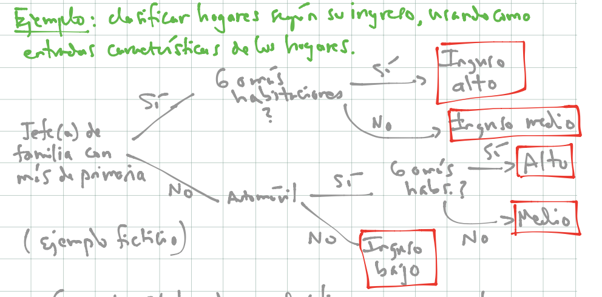
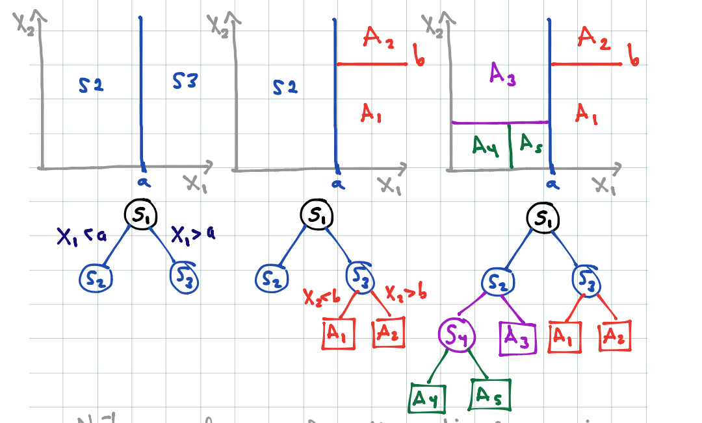

# Métodos basados en árboles

## Árboles para regresión y clasificación.

La idea básica de los árboles es buscar puntos
de cortes en las variables de entrada para
hacer predicciones, ir dividiendo la muestra,
y encontrar cortes sucesivos para refinar las predicciones.

#### Ejemplo {-}
Buscamos clasificar hogares según su ingreso, usando
como entradas características de los hogares. Podríamos tener,
por ejemplo:

```{r}

```

- Con este árbol podemos clasificar nuevos hogares.
- Nótese que los árboles pueden capturar interacciones entre las
variables de entradas. En nuestro ejemplo ficticio, "automóvil" nos
da información acerca del ingreso, pero solo caundo el nivel de educación
del jefe de familia es bajo. (Ejercicio: si el ingreso fuera una cantidad numérica, ¿cómo escribirías este modelo con una suma
de términos que involucren las variables mostradas en el diagrama?)
- Los árboles también pueden aproximar relaciones no lineales entre entradas
y variable de salida (es similar a los ejemplos donde haciamos categorización
de variables de entrada).
- Igual que en redes neuronales, en lugar de buscar puntos de corte o interacciones
a mano, con los árboles intentamos encontrarlos de manera automática.


### Árboles para clasificación

Un árbol particiona el espacio de entradas en rectángulos paralelos a los
ejes, y hace predicciones basadas en un modelo simple dentro de
cada una de esas particiones.

Por ejemplo:

```{r}

```

- El proceso de partición binaria recursiva (con una entrada a la vez)
puede representarse mediante árboles binarios.
- Los nodos terminales representan a la partición obtenida.

Para definir el proceso de construcción de los árboles, debemos definir:

1. ¿Cómo escoger las particiones? Idea: buscar hacer los nodos sucesivamente
más puros (que una sola clase domine).
2. ¿Cuándo declarar a un nodo como terminal? ¿Cuándo particionar más profundamente? Idea: dependiendo de la aplicación, buscamos hacer árboles
chicos, o en otras árboles grandes que después podamos para no sobreajustar.
3. ¿Cómo hacer predicciones en nodos terminales? Idea: escoger la clase más
común en cada nodo terminal (la de máxima probabilidad).


### Tipos de partición

Supongamos que tenemos variables de entrada $(X_1,\ldots, X_p)$. Recursivamente
particionamos cada nodo escogiendo entre particiones tales que:

- Dependen de una sola variable de entrada $X_i$
- Si $X_i$ es continua, la partición es de la forma $\{X_i\leq c\},\{X_i> c\}$,
para alguna $c$ (punto de corte)
- Si $X_i$ es categórica, la partición es de la forma
$\{X_i\in S\},\{X_i\notin S\}$, para algún subconjunto $S$ de categorías de $X_i$.
- En cada nodo candidato, escogemos uno de estos cortes para particionar.

¿Cómo escogemos la partición en cada nodo? En cada nodo, la partición
se escoge de una manera miope o local, intentando separar las
clases lo mejor que se pueda (sin considerar qué pasa en cortes hechos
más adelante). En un nodo dado, escogemos la partición que 
**reduce lo más posible su impureza**.

### Medidas de impureza

Consideramos un nodo $t$ de un árbol $T$, y sean $p_1(t),\ldots, p_K(t)$ las
proporciones de casos de $t$ que caen en cada categoría.

```{block2, type='comentario'}
La **impureza** de un nodo $t$ está dada por 
$$i(t) = -\sum_{j=1}^K p_j(t)\log p_j(t)$$
Este medida se llama entropía. Hay otras posibilidades como medida
de impureza (por ejemplo, coeficiente de Gini).
```


#### Ejemplo
Graficamos la medida de impureza para dos clases:
```{r, fig.width=5}
impureza <- function(p){
  -(p*log(p) + (1-p)*log(1-p))
}
curve(impureza, 0,1)
```

Donde vemos que la máxima impureza se alcanza cuando las proporciones de 
clase en un nodo son 50-50, y la mínima impureza (máxima pureza) se alcanza
cuando en el nodo solo hay casos de una clase. Nótese que esta cantidad es proporcional a la devianza del nodo, donde tenemos porbabilidad constante de clase 1 igual a $p$.


### Reglas de partición y tamaño del árobl

Podemos escribir la regla de partición, que se aplica a cada nodo de un árbol

```{block2, type='comentario'}
**Regla de partición**
En cada nodo, buscamos entre **todas** las variables $X_i$ y  **todos**
los puntos de corte $c$ la que da la mayor reducción
de impureza posible (donde la impureza de un corte es el promedio
ponderado por casos de las impurezas de los nodos resultantes).
```


#### Ejemplo {-}
Consideremos un nodo $t$, cuyos casos de entrenamiento son:
```{r}
n_t <- c(200,100, 150)
impureza <- function(p){
  -sum(p*log(p))
}
impureza(n_t/sum(n_t))

```
Y comparamos con
```{r}
n_t <- c(300,10, 140)
impureza <- function(p){
  p <- p[p>0]
  -sum(p*log(p))
}
impureza(n_t/sum(n_t))
```

Ahora supongamos que tenemos un posible corte, el primero
resulta en
```{r}
n_t <- c(300,10, 140)
n_1 = c(300,0,0)
n_2 = c(0,10,140)
(sum(n_1)/sum(n_t))*impureza(n_1/sum(n_1)) + (sum(n_2)/sum(n_t))*impureza(n_2/sum(n_2))
```
Un peor corte es:
```{r}
n_t <- c(300,10, 140)
n_1 = c(200,0,40)
n_2 = c(100,10,100)
(sum(n_1)/sum(n_t))*impureza(n_1/sum(n_1)) + (sum(n_2)/sum(n_t))*impureza(n_2/sum(n_2))
```


Lo que resta explicar es qué criterio de paro utilizamos para dejar de particionar.

```{block2, type='comentario'}
**Regla de paro**
Cuando usemos árboles en ótros métodos, generalmente hay dos opciones:

- Particionar hasta cierta profundidad fija (por ejemplo, máximo 8 nodos terminales). Este enfoque generalmente usa árboles relativamente chicos (se usa en boosting de árboles).
- Dejar de particionar cuando encontramos un número mínimo de casos en un nodo (por ejemplo, 5 o 10 casos). Este enfoque resulta en árboles grandes, probablemente sobreajustados (se usa en bosques aleatorios).
  
Y cuando utilizamos los árboles por sí solos para hacer predicciones:
  
- Podemos probar distintos valores de tamaño de árbol, y escogemos por validación (muestra o cruzada) el tamaño final.
- Podemos usar el método CART de Breiman, que consiste en construir un árbol
grande y luego podar al tamaño correcto.
```


#### Ejemplo {-}

Construímos algunos árboles con los datos de spam:


```{r, message=FALSE, warning=FALSE}
library(rpart)    			   
library(rpart.plot)
library(ggplot2)
library(dplyr)
library(tidyr)
spam_entrena <- read.csv('../datos/spam-entrena.csv')
spam_prueba <- read.csv('../datos/spam-prueba.csv')
head(spam_entrena)
```

Podemos construir un árbol grande. En este caso, 
buscamos que los nodos resultantes tengan al menos un caso
y para particionar pedimos que el nodo tenga al menos 10 casos:

```{r}
set.seed(22)
control_completo <- rpart.control(cp=0, 
                                  minsplit=10, 
                                  minbucket=1, 
                                  xval=10, 
                                  maxdepth=30)
spam_tree_completo<-rpart(spam ~ ., data = spam_entrena, method = "class",
                          control = control_completo)
prp(spam_tree_completo, type=4, extra=4)

```

Podemos examinar la parte de arriba del árbol:
```{r}
arbol.chico.1 <- prune(spam_tree_completo, cp=0.07)
prp(arbol.chico.1, type = 4, extra = 4)
```

Podemos hacer predicciones con este árbol grande. Por ejemplo, en entrenamiento tenemos:

```{r}
prop <- predict(spam_tree_completo, newdata = spam_entrena)
table(prop[,2]>0.5, spam_entrena$spam )
```
y en prueba:

```{r}
prop_arbol_grande <- predict(spam_tree_completo, newdata = spam_prueba)
tab_confusion <- table(prop_arbol_grande[,2]>0.5, spam_prueba$spam )
prop.table(tab_confusion, 2)
```
Y notamos la brecha grande entre prueba y entrenamiento, lo que sugiere sobreajuste. Este árbol es demasiado grande.


### Costo - Complejidad (Breiman)

Una manera de escoger árboles del tamaño correcto es utilizando una medida inventada
por Breiman para medir la calidad de un árbol. La complejidad
de un árbol $T$ está dada por (para $\alpha$ fija):

$$C_\alpha (T) = \overline{err}(T) + \alpha \vert T\vert$$
donde

- $\overline{err}(T)$ es el error de clasificación de $T$
- $\vert T\vert$ es el número de nodos terminales del árbol
- $\alpha>0$ es un parámetro de penalización del tamaño del árbol.

Esta medida de complejidad incluye qué tan bien clasifica el árbol
en la muestra de entrenamiento, pero penaliza por el tamaño del árbol.


Para escoger el tamaño del árbol correcto, definimos
$T_\alpha \subset T$ como el subárbol de $T$ que
minimiza la medida $C_\alpha (T_\alpha)$.

Para entender esta decisión, obsérvese que:

- Un subárbol grande de $T$ tiene menor valor de $\overline{err}(T)$ (pues usa más cortes)
- Pero un subárbol grande de $T$ tiene más penalización por complejidad $\alpha\vert T\vert$.


De modo que para $\alpha$ fija, el árbol $T_\alpha$ hace un
balance entre error de entrenamiento y penalización por complejidad.


#### Ejemplo

Podemos ver subárboles más chicos creados durante el procedimiento de división
de nodos (prp está el paquete rpart.plot). En este caso
pondemos $\alpha = 0.2$ (cp = $\alpha$ = complexity parameter):

```{r}
arbol.chico.1 <- prune(spam_tree_completo, cp=0.2)
prp(arbol.chico.1, type = 4, extra = 4)
```

Si disminuimos el coeficiente $\alpha$.

```{r}
arbol.chico.1 <- prune(spam_tree_completo, cp=0.07)
prp(arbol.chico.1, type = 4, extra = 4)
```

y vemos que en efecto el árbol $T_{0.07}$ contiene al árbol
$T_{0.2}$, y ambos son subárboles del árbol gigante que construimos al principio.


```{block2, type='comentario'}
Para podar un árbol con costo-complejidad, encontramos para
cada $\alpha>0$ (coeficiente de complejidad) un árbol
$T_\alpha\subset T$ que minimiza el costo-complejidad. Esto resulta
en una sucesión de árboles
$T_0\subset T_1\subset T_2\subset \cdots T_m\subset T$,
de donde podemos escoger con validación el árbol óptimo.
```

*Nota*: Esto es un teorema que hace falta demostrar: el resultado
principal es que conforme aumentamos $\alpha$, vamos eliminiando
ramas del árbol, de manera que los 


```{r}
arbol.chico.1 <- prune(spam_tree_completo, cp=0.05)
prp(arbol.chico.1, type = 4, extra = 4)
```


```{r}
arbol.chico.1 <- prune(spam_tree_completo, cp=0.02)
prp(arbol.chico.1, type = 4, extra = 4)
```

```{r}
source('../scripts/fancyRpartPlot.R')
fancyRpartPlot(arbol.chico.1, sub='')
```


**Nota**: Enfoques de predicción basados en un solo árbol para
clasificación y regresión son típicamente superados en 
predicción por otros métodos. ¿Cuál crees que sea la razón? ¿Es un
problema de varianza o sesgo?


### (Opcional) Predicciones con CART

Podemos hacer predicciones con un sólo árbol. En el caso de spam, haríamos

```{r}
set.seed(9293) # para hacer reproducible la validación cruzada
spam_tree <-rpart(spam ~ ., data = spam_entrena, 
                  method = "class", control=list(cp=0, 
                                              minsplit=5,minbucket=1))
```

Ahora mostramos los resultados de cada árbol para cada
valor de $\alpha$. La siguiente función nos da una estimación
de validación cruzada del error:

```{r}
printcp(spam_tree)
```

Y usamos la regla de mínimo error o a una desviación estándar
del error mínimo:

```{r}
arbol_podado <- prune(spam_tree, cp =  0.00130301)
prp(arbol_podado)
```

Cuyo error de predicción es:

```{r}
prop_arbol_podado <- predict(arbol_podado, newdata=spam_prueba)
head(prop_arbol_podado)
prop.table(table((prop_arbol_podado[,2]>0.5),spam_prueba$spam),2)
```


### Árboles para regresión

Para problemas de regresión, el criterio de pureza y la predicción
en cada nodo terminal es diferente:

- En los nodos terminales usamos el promedio los casos de entrenamiento que caen en tal nodo (en lugar de la clase más común)
- La impureza de define como varianza: si $t$ es un nodo, su impureza está dada por $\frac{1}{n(t)}\sum (y - m)^2$, donde la suma es sobre los casos que están en el nodo y $m$ es la media de las $y$'s del nodo.

### Variabilidad en el proceso de construcción

Existe variabilidad considerable en el proceso de división, lo cual
es una debilidad de los árboles.  Por ejemplo:

```{r}
set.seed(9923)
muestra.1 <- spam_entrena[sample(1:nrow(spam_entrena), nrow(spam_entrena), replace=T), ]
spam.tree.completo.1 <-rpart(spam ~ ., data =  muestra.1, method = "class",
                          control = control_completo)
arbol.chico.1 <- prune(spam.tree.completo.1, cp=0.03)
prp(arbol.chico.1, type = 4, extra = 4)
```

```{r}
muestra.1 <- spam_entrena[sample(1:nrow(spam_entrena), nrow(spam_entrena), replace=T), ]
spam.tree.completo.1 <-rpart(spam ~ ., data =  muestra.1, method = "class",
                          control = control_completo)
arbol.chico.1 <- prune(spam.tree.completo.1, cp=0.03)
prp(arbol.chico.1, type = 4, extra = 4)
```

Pequeñas diferencias en la muestra de entrenamiento produce
distintas selecciones de variables y puntos de corte, y estructuras
de árboles muchas veces distintas. Esto introduce varianza considerable
en las predicciones.


### Relaciones lineales

Los árboles pueden requerir ser muy grandes para estimar apropiadamente
relaciones lineales.

```{r}
x <- runif(200,0,1)
y <- 2*x + rnorm(200,0,0.1)
arbol <- rpart(y~x, data=data_frame(x=x, y=y), method = 'anova')
x_pred <- seq(0,1,0.05)
y_pred <- predict(arbol, newdata = data_frame(x=x_pred))
y_verdadera <- 2*x_pred
dat <- data_frame(x_pred=x_pred, y_pred=y_pred, y_verdadera=y_verdadera) %>% gather(y, valor, y_pred:y_verdadera)
ggplot(dat, aes(x=x_pred, y=valor, colour=y)) + geom_line()
```


### Ventajas y desventajas de árboles


Ventajas:

1. Árboles chicos son relativamente fáciles de explicar
2. Capturan interacciones entre las variables de entrada
3. Son robustos en el sentido de que
 - valores numéricos atípicos no hacen fallar al método
 - no es necesario transformar (monótonamente) variables de entrada
 - hay formas fáciles de lidiar con datos faltantes (cortes sucedáneos)
4. Se ajustan rápidamente y son relativamente fáciles de interpretar (por ejemplo, son útiles para clasificar en campo)
5. Árboles grandes generalmente no sufren de sesgo.

Desventajas:

1. Tienen dificultades en capturar estructuras lineales.
2. En la interpretación, tienen la dificultad de que muchas veces
algunas variables de entrada "enmascaran" a otras. Que una variable de entrada
no esté en el árbol no quiere decir que no sea "importante" para predecir
(regresión ridge lidia mejor con esto).
3. Son inestables (varianza alta) por construcción: es local/miope, basada
en cortes duros si/no. Esto produce desempeño predictivo relativamente malo.
(p ej: una pequeña diferencia en cortes iniciales puede resultar en estructuras
de árbol totalmente distintas).
4. Adicoinalmente, no son apropiados cuando hay variables categóricas con 
muchas niveles: en estos casos, el árbol sobreajusta desde los primeros
cortes, y las predicciones son malas.


## Bagging de árboles

Bosques aleatorios es un método de predicción que utiliza familias de
árboles para hacer predicciones.

Los árboles grandes tienen la ventaja de tener sesgo bajo, pero sufren de varianza alta. Podemos explotar el sesgo bajo si logramos controlar la varianza. Una idea primera para lograr esto es es hacer
**bagging** de árboles:

- Perturbar la muestra de entrenamiento de distintas maneras y producir árboles distintos (grandes). La perturbación más usada es tomar muestras bootstrap de los datos y ajustar un árbol a cada muestra bootstrap
- Promediar el resultado de todos estos árboles para hacer predicciones. El proceso de promediar reduce la varianza, sin tener pérdidas en sesgo.


La idea básica de bagging (*bootstrap aggregation*) es la siguiente:

Consideramos el proceso ${\mathcal L} \to T_{\mathcal L}$, que representa
el proceso de ajuste de un árbol $T_{\mathcal L}$ a partir de la muestra de entrenamiento ${\mathcal L}$.  Si pudiéramos obtener
distintas muestras de entrenamiento
$${\mathcal L}_1, {\mathcal L}_2, \ldots, {\mathcal L}_B,$$
y supongamos que construimos los árboles (que suponemos de regresión)
$$T_1, T_2, \ldots, T_B,$$
Podríamos mejorar nuestras predicciones construyendo el
árbol promedio
$$T(x) = \frac{1}{B}\sum_{i=b}^B  T_b (x)$$
¿Por qué es mejor este árbol promedio que cualquiera de sus componentes? Veamos primero el sesgo. El valor esperado del árbol
promedio es
$$E[T(x)] = \frac{1}{B}\sum_{i=b}^B  E[T_b (x)]$$
y como cada $T_b(x)$ se construye de la misma manera a partir
de ${\mathcal L}_b$, y todas las muestras ${\mathcal L}_b$ se 
extraen de la misma forma, todos los términos de la suma de la derecha son iguales:
$$E[T(x)] =  E[T_1 (x)],$$
lo que implica que el sesgo del promedio es igual al sesgo de
un solo árbol (que es bajo, pues suponemos que los árboles son grandes).


Ahora veamos la varianza. Como las muestras ${\mathcal L}_b$ se extraen *de manera independiente*, entonces

$$Var[T(x)] = Var\left( \frac{1}{B}\sum_{i=b}^B  T_b (x)\right) = \frac{1}{B^2}\sum_{i=b}^B  Var[T_b (x)],$$
pues los distintos $T_b(x)$ no están correlacionados (en ese caso, varianza
de la suma es la suma de las varianzas), y las constantes salen de la varianza
al cuadrado. Por las mismas razones que arriba, todos los términos de la derecha son iguales, y
$$Var[T(x)] = \frac{1}{B}\ Var[T_1 (x)]$$
de modo que la varianza del árbol promedio es mucho más chica
que la varianza de un árbol dado (si $B$ es grande).

Sin embargo, no podemos tomar muestras de entrenamiento repetidamente
para ajustar estos árboles. ¿Cómo podemos simular extraer distintas
muestras de entrenamiento?

```{block2, type='comentario'}
Sabemos que si tenemos una muestra de entrenamiento fija ${\mathcal L}$, podemos evaluar la variación
de esta muestra tomando **muestras bootstrap** de ${\mathcal L}$,
que denotamos por

$${\mathcal L}_1^*, {\mathcal L}_2^*, \ldots, {\mathcal L}_B^*,$$

Recordatorio: una muestra bootstrap de $\mathcal L$ es una muestra con con reemplazo
de ${\mathcal L}$ del mismo tamaño que ${\mathcal L}$.
```


Entonces la idea es que construimos los árboles (que suponemos de regresión)
$$T_1^*, T_2^*, \ldots, T_B^*,$$
podríamos mejorar nuestras predicciones construyendo el
árbol promedio
$$T^*(x) = \frac{1}{B}\sum_{i=b}^B  T_b^* (x)$$
para suavizar la variación de cada árbol individual.

El argumento del sesgo aplica en este caso, pero el de la varianza no
exactamente, pues las muestras bootstrap no son independientes (están correlacionadas a través de la muestra de entrenamiento de donde se obtuvieron),a pesar de que las muestras bootstrap se extraen de manera independiente de ${\mathcal L}$. De  esta forma, no esperamos una
reducción de varianza tan grande como en el caso de muestras independientes.


```{block2, type='comentario'}
**Bagging**
Sea ${\mathcal L} =\{(x^{(i)}, y^{(i)})\}_{i=1}^n$ una muestra de entrenamiento, y sean 
$${\mathcal L}_1^*, {\mathcal L}_2^*, \ldots, {\mathcal L}_B^*,$$
 muestras bootstrap de ${\mathcal L}$ (muestreamos con reemplazo
 los **pares** $(x^{(i)}, y^{(i)})$, para obtener una muestra de tamaño $n$).
 
1. Para cada muestra bootstrap construimos un árbol
 $${\mathcal L}_b^* \to T_b^*$$.
2. (Regresión) Promediamos árboles para reducir varianza
 $$T^*(x) = \frac{1}{B}\sum_{i=b}^B  T_b^*(x)$$
3. (Clasificación) Tomamos votos sobre todos los árboles:
 $$T^*(x) = argmax_g \{ \# \{i|T_b^*(x)=g\}\}.$$ Podemos
 también calcular probabilidades promedio sobre todos
 los árboles.

Bagging muchas veces reduce el error de predicción gracias
a una reducción modesta de varianza.
```


**Nota**: No hay garantía de bagging reduzca el error de entrenamiento, especialmente si los árboles base son muy
malos clasificadores ¿Puedes pensar en un ejemplo donde empeora?


### Ejemplo 
Probemos con el ejemplo de spam. Construimos árboles con muestras bootstrap
de los datos originales de entrenamiento:

```{r}
muestra_bootstrap <- function(df){
  df %>% sample_n(nrow(df), replace = TRUE)
}
arboles_bagged <- lapply(1:30, function(i){
  muestra <- muestra_bootstrap(spam_entrena)
  arbol <- rpart(spam ~ ., data = muestra, 
                  method = "class", control=list(cp=0, 
                                              minsplit=5,minbucket=1))
  arbol
})
```

Examinemos la parte de arriba de algunos de estos árboles:

```{r}
prp(prune(arboles_bagged[[1]], cp =0.01))
prp(prune(arboles_bagged[[2]], cp =0.01))
prp(prune(arboles_bagged[[3]], cp =0.01))

```
Ahora probemos hacer predicciones con los 30 árboles:

```{r}
library(purrr)
preds_clase <- lapply(arboles_bagged, function(arbol){
  preds <- predict(arbol, newdata = spam_prueba)[,2]
})
preds <- preds_clase %>% reduce(cbind)
dim(preds)
prop_bagging <- apply(preds, 1, mean)
prop.table(table(prop_bagging > 0.5, spam_prueba$spam),2)
```

Y vemos que tenemos una mejora inmediata con respecto un sólo árbol
grande (tanto un árbol grande como uno podado con costo-complejidad).
El único costo es el cómputo adicional para procesar las muestras bootstrap


```{block2, type ='comentario'}

- ¿Cuántas muestras bootstrap? Bagging generalmente funciona mejor
cuando tomamos tantas muestras como sea posible - aunque también es un 
parámetro que se puede afinar.
- Bagging por sí solo se usa rara vez. El método más poderoso es bosques aleatorios, donde el proceso
básico es bagging de árboles, pero añadimos ruido adicional en la 
construcción de árboles.
```


### Mejorando bagging

El factor que limita la mejora de desempeño de bagging es que
los árboles están correlacionados a través de la muestra de entrenamiento. Como
vimos, si los árboles fueran independientes, entonces mejoramos por un factor
de $B$ (número de muestras independientes). Veamos un argumento para entender
cómo esa correlación limita las mejoras:


Quiséramos calcular (para una $x$ fija)

$$Var(T(x)) = Var\left(\frac{1}{B}\sum_{i=1}^B T^*_i\right)$$

donde cada $T^*_i$ se construye a partir de una muestra bootstrap de ${\mathcal L}$.
Nótese que esta varianza es sobre la muestra de entrenamiento ${\mathcal L}$. Usando
la fórmula de la varianza para sumas generales:
\begin{equation}
Var(T(x)) = Var\left(\frac{1}{B}\sum_{i=1}^B T^*_i\right) =
\sum_{i=1}^B \frac{1}{B^2} Var(T^*_i(x)) + \frac{2}{B^2}\sum_{i < j} Cov(T_i^* (x), T_j^* (x))
  (\#eq:varianza-ensamble)
\end{equation}

Ponemos ahora

$$\sigma^2(x) = Var(T_i^* (x))$$
que son todas iguales porque los árboles bootstrap se extraen de la misma manera (${\mathcal L}\to {\mathcal L}^*\to T^*$).


Escribimos ahora
$$\rho(x) = corr(T_i^* (x), T_j^* (x))$$
que es una correlación sobre ${\mathcal L}$ (asegúrate que entiendes este término). Todas
estas correlaciones son iguales pues cada par de árboles se construye de la misma forma.

Así que la fórmula \@ref(eq:varianza-ensamble) queda

\begin{equation}
Var(T(x)) = 
 \frac{1}{B} \sigma^2(x) + \frac{B-1}{B} \rho(x)\sigma^2(x) =
 \sigma^2(x)\left(\frac{1}{B}  + \left(1-\frac{1}{B}\right )\rho(x)     \right)
  (\#eq:varianza-ensamble-2)
\end{equation}

En el límite (cuando B es muy grande, es decir, promediamos muchos árboles):

\begin{equation}
Var(T(x)) = Var\left(\frac{1}{B}\sum_{i=1}^B T^*_i\right) \approx
 \sigma^2(x)\rho(x)     
  (\#eq:varianza-ensamble-3)
\end{equation}

Si $\rho(x)=0$ (árboles no correlacionados), la varianza del ensemble
es la fracción $1/B$ de la varianza de un solo árbol, y obtenemos una
mejora considerable en varianza. En el otro extremo,
si la correlación es alta $\rho(x)\approx 1$, entonces no obtenemos ganancias
por promediar árboles y la varianza del ensamble es similar a la de un solo árbol.


```{block2, type='comentario'}
- Cuando hacemos bagging de árboles, la limitación de mejora cuando promediamos
muchos árboles está dada por la correlación entre ellos: cuanto más grande
es la correlación, menor beneficio en reducción de varianza obtenemos.
- Si alteramos el proceso para producir árboles menos correlacionados (menor $\rho(x)$), podemos
mejorar el desempeño de bagging. Sin embargo, estas alteraciones generalmente
están acompañadas de incrementos en la varianza ($\sigma^x(x)$). 
```


## Bosques aleatorios

Los bosques aleatorios son una versión de árboles de bagging decorrelacionados. Esto
se logra *introduciendo variabilidad en la construcción de los árboles* (esto es 
paradójico - pero la explicación está arriba: aunque la varianza empeora
(de cada árbol), la decorrelación de árboles puede valer la pena).

### Sabiduría de las masas
Una explicación simple de este proceso que se cita frecuentemente es el fenómeno de
la sabiduría de las masas: cuando promediamos estimaciones pobres de un gran número
de personas (digamos ignorantes), obtenemos mejores estimaciones que cualquiera de
las componentes individuales, o incluso mejores que estimaciones de expertos. Supongamos
por ejemplo que $G_1,G_2,\ldots, G_M$ son clasificadores débiles, por ejemplo
$$P(correcto) = P(G_i=G)=0.6$$ 
para un problema con probabilidad base $P(G=1)=0.5$. Supongamos que los predictores
son independientes, y sea $G^*$ el clasificador que se construye por mayoría
de votos a partir de $G_1,G_2,\ldots, G_M$, es decir
$G^*=1$ si y sólo si $\#\{ G_i = 1\} > M/2$.

Podemos ver que el número de aciertos (X) de $G_1,G_2,\ldots, G_M$, por independencia,
es binomial $Bin(M, 0.6)$. Si $M$ es grande, podemos aproximar esta distribución
con una normal con media $M*0.6$ y varianza $0.6*0.4*M$. Esto implica que

$$P(G^* correcto)=P(X > 0.5M) \approx 
P\left( Z > \frac{0.5M-0.6M}{\sqrt(0.24M)}\right) = P\left(Z > -2.041 \sqrt{M}\right)$$

Y ahora observamos que cuando $M$ es grande, la cantidad de la derecha tiende a 1:
la masa, en promedio, tiene la razón!

Nótese, sin embargo, que baja dependencia entre las "opiniones" es parte crucial del argumento,
es decir, las opiniones deben estar decorrelacionadas.

----------

El proceso de decorrelación de bosques aleatorios consiste en que cada vez que tengamos que hacer
un corte en un árbol de bagging, escoger al azar un número de variables y usar estas
para buscar la mejor variable y el mejor punto de corte, como hicimos en la construcción
de árboles.

```{block2}
**Bosques aleatorios**
Sea $m$ fija.
Sea ${\mathcal L} =\{(x^{(i)}, y^{(i)})\}_{i=1}^n$ una muestra de entrenamiento, y sean 
$${\mathcal L}_1^*, {\mathcal L}_2^*, \ldots, {\mathcal L}_B^*,$$
 muestras bootstrap de ${\mathcal L}$ (muestreamos con reemplazo
 los **pares** $(x^{(i)}, y^{(i)})$, para obtener una muestra de tamaño $n$).
 
1. Para cada muestra bootstrap construimos un árbol
 $${\mathcal L}_b^* \to T_b^*$$ de la siguiente forma:
  - En cada nodo candidato a particionar, escogemos al azar $m$ variables de las disponibles
  - Buscamos la mejor variable y punto de corte (como en un árbol normal) pero *solo entre
  las variables que seleccionamos al azar*.
  - Seguimos hasta construir un árbol grande.
2. (Regresión) Promediamos árboles para reducir varianza
 $$T^*(x) = \frac{1}{B}\sum_{i=b}^B  T_b^*(x)$$
3. (Clasificación) Tomamos votos sobre todos los árboles:
 $$T^*(x) = argmax_g \{ \# \{i|T_b^*(x)=g\}\}.$$ Podemos
 también calcular probabilidades promedio sobre todos
 los árboles.

Bosques aleatorios muchas veces reduce el error de predicción gracias
a una reducción a veces considerable de varianza. El objetivo final es reducir
la varianza alta que producen árboles normales debido a la forma tan agresiva
de construir sus cortes.
```

**Observaciones**:

1. El número de variables $m$ que se seleccionan en cada nodo es un parámetro
que hay que escoger (usando validación, validación cruzada).
2. Ojo: no se selecciona un conjunto de $m$ variables para cada árbol. En la construcción
de cada árbol, en cada nodo se seleccionan $m$ variables como candidatas para cortes.
3. Como inducimos aleatoriedad en la construcción de árboles,
este proceso reduce la correlación entre árboles del bosque, aunque también incrementa
su varianza. Los bosques aleatorios funcionan bien cuando la mejora en correlación 
es más grande que la pérdida en varianza.
4. Reducir $m$, a grandes rasgos:
  - Aumenta el sesgo del bosque (pues es más restringido el proceso de construcción)
  - Disminuye la correlación entre árboles y aumenta la varianza de cada árbol
5. Intrementar $m$
  - Disminuye el sesgo del bosque (menos restricción)
  - Aumenta la correlacción entre árobles y disminuye la varianza de cada árbol


### Ejemplo
Regresamos a nuestro ejemplo de spam. Intentemos con 500 árboles, y 
6 variables (de 58 variables) para escoger como candidatos en cada corte:

```{r, warning=FALSE, message=FALSE}
library(ranger)
bosque_spam <-ranger(factor(spam) ~ ., data = spam_entrena, 
                           num.trees = 1500, mtry = 6, importance="permutation",
                     probability = TRUE)
```

Evaluamos desempeño, donde vemos que obtenemos una mejora inmediata con respecto
a bagging:

```{r}
probas <- predict(bosque_spam, data = spam_prueba)$prediction
head(probas)
prop_bosque <- probas[,2]
table(prop_bosque> 0.5, spam_prueba$spam) %>% prop.table(2) %>% round(3)
```


Comparemos las curvas ROC para:

- árbol grande sin podar
- árbol podado con costo-complejidad
- bagging de árboles
- bosque aleatorio

Las curvas de precision-recall

```{r, message=FALSE, warning=FALSE}
library(ROCR)
pred_arbol <- prediction(prop_arbol_grande[,2], spam_prueba$spam)
pred_podado <- prediction(prop_arbol_podado[,2], spam_prueba$spam)
pred_bagging <- prediction(prop_bagging, spam_prueba$spam)
pred_bosque <- prediction(prop_bosque, spam_prueba$spam)
preds_roc <- list(pred_arbol, pred_podado, pred_bagging, pred_bosque)
perfs <- lapply(preds_roc, function(pred){
  performance(pred, x.measure = 'prec', measure = 'rec')
})
plot(perfs[[1]],  lwd=2, xlim=c(0,1))
plot(perfs[[2]], add=TRUE, col='orange', lwd=2)
plot(perfs[[3]], add=TRUE, col='gray', lwd=2)
plot(perfs[[4]], add=TRUE, col='purple', lwd=2)

```

O las curvas ROC

```{r}
perfs <- lapply(preds_roc, function(pred){
  performance(pred, x.measure = 'fpr', measure = 'sens')
})
plot(perfs[[1]],  lwd=2)
plot(perfs[[2]], add=TRUE, col='orange', lwd=2)
plot(perfs[[3]], add=TRUE, col='gray', lwd=2)
plot(perfs[[4]], add=TRUE, col='purple', lwd=2)
```

--------

### Más detalles de bosques aleatorios.

Los bosques aleatorios, por su proceso de construcción, tienen aspectos interesantes.

En primer lugar, tenemos la estimación de error de prueba **Out-of-Bag** (OOB), que 
es una estimación honesta del error de predicción basada en el proceso de bagging.

Obsérvese en primer lugar, que cuando tomamos muestras con reemplazo para construir
cada árbol, algunos casos de entrenamiento aparecen más de una vez, y otros 
casos no se usan en la construcción del árbol. La idea es entonces es usar esos
casos excluidos para hacer una estimación honesta del error.

#### Ejemplo {-}
Si tenemos una muestra de entrenamiento 
```{r}
entrena <- data_frame(x=1:10, y=rnorm(10, 1:10, 5))
entrena
```

Tomamos una muestra bootstrap:
```{r}
entrena_boot <- sample_n(entrena, 10, replace = TRUE)
entrena_boot
```

Construimos un predictor
```{r}
mod_boot <- lm(y~x, data = entrena_boot)
```

y ahora obtenemos los datos que no se usaron:

```{r}
prueba_boot <- anti_join(entrena, entrena_boot)
prueba_boot
```

y usamos estos tres casos para estimar el error de predicción:

```{r}
mean(abs(predict(mod_boot, prueba_boot)-prueba_boot$y))
```

Esta es la estimación OOB (out-of-bag) para este modelo particular.

------

En un principio podemos pensar que quizá por mala suerte obtenemos
pocos elementos OOB para evaluar el error, pero en realidad para muestras
no tan chicas obtenemos una fracción considerable.

```{block2, type='comentario'}
Cuando el tamaño de muestra $n$ es grande, el porcentaje esperado de casos que
no están en la muestra bootstrap es alrededor del 37\%
```

Demuestra usando probabilidad y teoría de muestras con reemplazo.


```{block2, type='comentario'}
**Estimación OOB del error**

Consideramos un bosque aleatorio $T_{ba}$con árboles $T_1^*, T_2^*, \ldots, T_B^*$, y conjunto de 
entrenamiento original
${\mathcal L} =\{(x^{(i)}, y^{(i)}\}_{i=1}^n$. 
Para cada caso de entrenamiento $(x^{(i)}, y^{(i)})$ consideramos todos los árboles
que **no** usaron este caso para construirse, y construimos un bosque $T_{ba}^{(i)}$
basado solamente en esos árboles.
La predicción OOB de $T_{ba}^{(i)}$ para $(x^{(i)}, y^{(i)})$ es
$$y_{oob}^{(i)} = T_{ba}^{(i)}(x^{(i)})$$
El error OOB del árbol $T_{ba}$ está dado por 
1. Regresión (error cuadrático medio)
$$\hat{Err}_{oob} = \frac{1}{n} \sum_{i=1}^n (y^{(i)} - y_{oob}^{(i)})^2$$
2. Clasificación (error de clasificación)
$$\hat{Err}_{oob} = \frac{1}{n}\sum_{i=1}^n I(y^{(i)} = y_{oob}^{(i)})$$

```

- Para cada dato de entrenamiento, hacemos predicciones usando solamente los árboles
que no consideraron ese dato en su construcción. Estas predicciones son las que evaluamos
- Es una especie de validación cruzada (se puede demostrar que es similar a 
validacion cruzada leave-one-out), pero es barata en términos computacionales.
- Como discutimos en validación cruzada, esto hace de OOB una buena medida de error para
afinar los parámetros del modelo (principalmente el número $m$ de variables que se escogen
en cada corte).

#### Ejempo {-}
Para el ejemplo de spam, podemos ver el error OOB ( y matriz de confusión también OOB):
```{r}
bosque_spam
```

Que comparamos con
```{r}
prop_bosque <- probas[,2]
tab <- table(prop_bosque> 0.5, spam_prueba$spam) %>% prop.table() %>% round(3)
1-sum(diag(tab))
```
